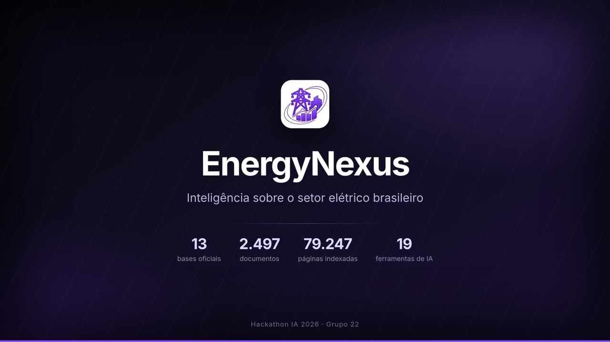

# EnergyNexus

## A ideia

Quem analisa o setor elétrico brasileiro não sofre por falta de dado: sofre por dado espalhado. A receita da empresa
está num pacote da CVM, a qualidade do serviço num ranking da ANEEL, a geração e o corte de geração em planilhas do ONS,
o financiamento nos dados abertos do BNDES, a projeção no PDE da EPE, e a versão que a empresa conta de si mesma está
num PDF de 200 páginas no site de RI. Montar uma comparação simples entre duas concessionárias custa dias de planilha —
e, no fim, ninguém sabe dizer de que linha de que arquivo veio cada número.

O EnergyNexus ataca isso em duas camadas:

1. **Uma base de dados do setor.** Tudo o que é público e relevante — financeiro, regulatório, operativo, climático e
   de crédito — baixado das fontes oficiais, padronizado por empresa (CNPJ) e por período, numa base única que responde
   a uma pergunta em milissegundos. Os relatórios em PDF entram junto, página por página, indexados por significado.
2. **Uma inteligência competitiva em cima dela.** Em vez de aprender SQL ou caçar a aba certa da planilha, o usuário
   pergunta em português. Um agente escolhe as consultas, cruza base estruturada com o texto dos relatórios, e devolve
   **a conclusão** — não um despejo de dados — com **a fonte de cada número** (arquivo, página, conta contábil, ano) e
   um PDF pronto para levar ao comitê. Painéis, grafo de conhecimento, busca por página e linha do tempo ficam ao lado,
   para quem quiser navegar, conferir e auditar com o próprio olho.

O objetivo é o tempo entre a pergunta e a decisão: **consultar, auditar e concluir rápido**, sem depender de ninguém
para extrair dado, e sem ter que confiar num número que não se pode rastrear.

A base, hoje:

| | |
|---|---|
| **106 tabelas** | CVM, ANEEL, ONS, EPE/MME, BNDES, B3, ANBIMA/SND e Banco Central |
| **151 empresas** | conciliadas por CNPJ, com apelidos, tickers e grupo econômico |
| **2.497 relatórios** | financeiros e de sustentabilidade, de 2003 a 2026 |
| **79.247 páginas** | indexadas por significado, com trecho literal e imagem da página |
| **17 ferramentas** | o que o agente pode acionar sozinho para responder |

## Demo

71 segundos, sem áudio: uma pergunta de comitê, as sete consultas que o agente dispara, a resposta com a tabela e a
fonte de cada conta, o relatório em PDF gerado no clique de um botão, e as telas de apoio.

<video src="https://github.com/Hackathon-IA-2026/solucoes-grupo-22/raw/main/img/demo_energynexus.mp4" poster="https://github.com/Hackathon-IA-2026/solucoes-grupo-22/raw/main/img/demo_capa.jpg" controls muted width="100%"></video>

<a href="https://github.com/Hackathon-IA-2026/solucoes-grupo-22/raw/main/img/demo_energynexus.mp4">
  
</a>

O arquivo está em [`img/demo_energynexus.mp4`](img/demo_energynexus.mp4) (1920x1080, 23 MB) — se o player acima não
abrir, clique na miniatura. O chat em si roda nos servidores do IMPA e é aberto por túnel SSH (veja "Como rodar").

## Como funciona

A pergunta chega em português. O agente decide o que consultar, chama as ferramentas, confere e responde:

```
pergunta  ->  agente (Claude no Bedrock ou Qwen próprio no vLLM)
                 |-- energynexus-dados     -> SQL na base do setor (DuckDB)
                 |-- energynexus-docs      -> trecho e página dos relatórios (busca vetorial)
                 |-- energynexus-placar    -> ESG declarado x dado oficial, telas HTML
                 |-- energynexus-relatorio -> PDF em LaTeX, no modelo do EnergyNexus
              resposta com a fonte de cada número (+ artefato PDF, quando pedido)
```

São quatro servidores MCP, com **17 ferramentas** próprias; somando as nativas do chat (carregar roteiro e busca web),
dá as 19 que aparecem no vídeo:

| Servidor | Ferramentas |
|---|---|
| `energynexus-dados` | `buscar_empresa`, `indicadores_financeiros`, `listar_tabelas`, `descrever_tabela`, `valores_distintos`, `consultar_sql` |
| `energynexus-docs` | `buscar_documentos`, `ler_pagina`, `listar_documentos` |
| `energynexus-placar` | `consultar_placar`, `placar_ranking`, `radar_consistencia`, `exposicao_carbono`, `tela_ranking`, `tela_radar`, `tela_carbono` |
| `energynexus-relatorio` | `gerar_relatorio` |

Cada ferramenta devolve a procedência junto com o valor: tabela e ressalvas no caso da base, arquivo e página no caso
do relatório, conta e critério de cálculo no caso do indicador financeiro. É isso que torna a resposta auditável.

Sete **roteiros** (`proper_skills/`) padronizam as análises recorrentes, e o agente carrega o que a pergunta pedir:
benchmark de distribuidoras, benchmark socioambiental, ficha de crédito, investimento na transição, avaliação
climática, relatório final e o modo conclusivo (a resposta é descritiva por padrão; parecer e recomendação só quando o
usuário pede).

## Tecnologias utilizadas

- **Linguagens:** Python 3.12 (ferramentas MCP, coleta, extração e testes), TypeScript/JavaScript (interface, Node
  v24.16), SQL (DuckDB), Bash (scripts de instalação e operação), LaTeX (relatório final)
- **Dados:** DuckDB 1.5.5 — a base do setor (106 tabelas) e o índice vetorial dos PDFs (`FLOAT[1024]`, busca por
  similaridade de cosseno em SQL); PyArrow 25 e Parquet na coleta; PyMuPDF 1.28 para extrair texto e imagem de página
- **Modelos:** Claude Sonnet 5 e Opus 5 pelo **Amazon Bedrock**; **Qwen3.8-27B INT4 próprio**, servido por **vLLM** com
  256 mil tokens de contexto (`./vllm.sh`); embeddings **Amazon Titan Text Embeddings v2** (1024 dimensões) para o
  índice em uso, com `multilingual-e5-large` via fastembed 0.8 como alternativa local em GPU
- **Agente e ferramentas:** **MCP 2.2** (Model Context Protocol) — quatro servidores próprios, 17 ferramentas; roteiros
  em Markdown (skills); **LibreChat v0.8.7** como interface de chat (tema, logo, painel de PDF e as abas próprias)
- **Nuvem:** **Amazon Bedrock AgentCore Runtime** hospeda os servidores `dados` e `docs` (contêineres ARM64, banco
  baixado do **S3** na partida, autenticação por **JWT do Amazon Cognito**), com infraestrutura em **AWS CDK** /
  CloudFormation; `boto3` 1.43
- **Interface:** React 18 + Vite 8 + TypeScript 5.9, gráficos em SVG escritos à mão (sem biblioteca de charts), grafo
  de conhecimento montado no navegador
- **Relatório:** pdflatex do **TinyTeX** (2026.09), modelo LaTeX próprio + referências em BibTeX
- **Infra local:** MongoDB 8.0 e Meilisearch 1.35 (usuários, conversas e busca do chat), tudo instalado dentro de
  `.runtime/` pelo `instalar.sh` — nada é instalado no sistema
- **Fontes externas:** dados abertos da CVM, ANEEL, ONS, EPE/MME, BNDES, B3, ANBIMA/SND e Banco Central (SGS); Serper
  e Jina para busca web (opcional)
- **Testes:** pytest 9 (ferramentas e dados), regressão com 34 perguntas de resposta conhecida, E2E das telas em
  Playwright

## Placar da Transição

O que a empresa **diz** no relatório, ao lado do que os dados oficiais **mostram**. `data/extrair_placar.py` lê os
relatórios já indexados e monta `data/placar.duckdb` com emissões por escopo, metas climáticas, % renovável, CAPEX e
frameworks de divulgação — cada valor com arquivo, página e o trecho literal. Dois filtros mantêm a base limpa: o
valor só entra se **aparecer na página citada** e se **duas leituras do modelo concordarem** (tabela achatada em PDF
é ambígua e o modelo escolhe colunas diferentes a cada leitura). `data/conferir_placar.py` compara a extração com o
gabarito conferido à mão.

No chat, as ferramentas de `energynexus-placar`:

| Ferramenta | O que faz |
|---|---|
| `consultar_placar` | o placar de uma empresa, com métricas híbridas (tCO2e por R$ mi de receita, CAPEX/receita) |
| `placar_ranking` | ranking entre empresas: score de divulgação, intensidade, escopo 1+2, % renovável |
| `radar_consistencia` | alertas de divergência entre o relatório e o dado oficial (SIGA/CVM), com as duas evidências |
| `exposicao_carbono` | emissões × preço de carbono contra EBITDA e lucro, com a fórmula |
| `tela_ranking`, `tela_radar`, `tela_carbono` | a mesma informação como página HTML (gráfico, tabela e a fonte de cada número), servida em `/relatorios/` |

## Relatório final

Quando o usuário pede um relatório (ou memorando, ficha, nota para comitê — ou clica no botão "Gerar relatório em PDF"
ao lado do campo de mensagem), o modelo carrega o roteiro `proper_skills/relatorio-energynexus/SKILL.md` (as instruções
do modelo oficial: seis seções fixas, fonte de cada fato, distinção entre fato e análise, referências em BibTeX),
levanta os dados e chama `gerar_relatorio`. A ferramenta confere a estrutura e as citações, preenche
`proper_mcps/relatorio/modelo/main.tex` e `referencias.bib`, compila com o pdflatex do TinyTeX (`.runtime/tinytex`) e
grava o PDF e o fonte LaTeX em `.runtime/relatorios`, servidos em `/relatorios/`. A resposta traz um bloco
`:::artifact` do tipo `application/pdf`: o PDF abre grande no painel à direita, com o botão de baixar.

## Painéis de apoio: Painel, Busca, Grafo e Timeline

Ao lado do chat (ícones na barra lateral), só para usuários logados. São o caminho visual para a mesma base que o
agente consulta — serve para explorar antes de perguntar e para conferir depois de responder:

- **Painel** (`/painel`): dashboards das tabelas do banco (indicadores financeiros, DEC/FEC, CMO, EAR, curtailment,
  capacidade, usinas, leilões, PDD, BNDES, debêntures): um cartão com tendência para cada medida numérica, evolução no
  tempo (até 8 empresas comparadas), ranking e as linhas da base com download em CSV. O filtro de empresa acha pelo
  nome, apelido, ticker ou CNPJ. Lê `data/painel.json`, relido a cada acesso: depois de reconstruir o banco, basta
  rodar `data/exportar_painel.py` de novo.
- **Busca** (`/busca`): responde "em que página está isso?" nos PDFs indexados, com o trecho, a imagem da página e o
  PDF. Usa o mesmo índice e modelo do `energynexus-docs` (`data/docs_titan.duckdb`, Titan pelo Bedrock); o `iniciar.sh`
  sobe `proper_mcps/docs/busca.py` em `127.0.0.1:BUSCA_PORTA` e o LibreChat repassa `/api/busca`.
- **Grafo** (`/grafo`, `?empresa=<CNPJ só com dígitos>`): grafo de conhecimento de uma empresa. Empresa → categoria
  (cada base do painel com dados dela, e os documentos por área) → indicadores (as medidas do painel, por período, com
  a mesma regra de agregação) e referências (a base, ou o PDF, agrupados por tipo). O CNPJ é o que liga as bases do
  `painel.json` entre si e aos documentos de `/api/busca/resumo`; o grafo é montado no navegador. Arraste para navegar,
  roda do mouse para zoom, duplo clique recolhe ou expande, clique abre os dados e a fonte.
- **Timeline**: a evolução de cada empresa — eventos por ano com impacto, indicadores e fonte, trajetórias estratégicas
  e gráficos. É montada na hora, para a empresa e o período escolhidos na tela, pelo serviço da Busca
  (`data/linha_do_tempo.py` como biblioteca), a partir dos parágrafos dos relatórios.

## Pré-requisitos

- Linux com `python3` (com `venv`), `curl`, `git` e `openssl`. Node, MongoDB, Meilisearch e o TinyTeX o `instalar.sh`
  baixa sozinho para `.runtime/`.
- Internet na primeira vez (bibliotecas, binários, pacotes do LaTeX e, no `vllm.sh`, cerca de 19 GB de pesos).
- Um modelo: credenciais da AWS para o Bedrock **ou** uma GPU NVIDIA de 32 GB ou mais para o modelo próprio (sem GPU,
  dá para apontar para um vLLM em outra máquina).
- Uns 5 GB de disco livre para os bancos prontos em `data/` — bem mais se for reprocessar os PDFs da fonte — além do
  que o `.runtime/` ocupa (Node, MongoDB, Meilisearch, TinyTeX e, com o modelo próprio, os pesos).

Nada é fixo de usuário ou de máquina: tudo fica dentro da pasta onde o repositório foi clonado (`.runtime/` para
binários, bancos do chat, logs, relatórios e vLLM; `data/` para os dados) e as escolhas locais (portas, chaves, endereço
do modelo) ficam no `.env`.

## Como rodar

Passo a passo, do clone ao primeiro relatório.

**1. Clonar o repositório e entrar na pasta**

```bash
git clone git@github.com:Hackathon-IA-2026/solucoes-grupo-22.git energynexus
cd energynexus
```

**2. Instalar (uma vez só)**

```bash
./instalar.sh
```

Isso cria o `.env` a partir do `.env.example` com segredos novos, baixa Node v24, MongoDB, Meilisearch e o TinyTeX para
`.runtime/`, instala os pacotes LaTeX do relatório, roda `npm ci`, compila a interface e monta o Python das ferramentas
em `.runtime/venv`. Leva alguns minutos e não toca em nada fora da pasta.

**3. Colocar os dados em `data/`**

Os dados não vão para o git. O caminho curto é copiar os bancos prontos da pasta `bancos/` do Drive do projeto para
`data/`; o caminho longo (refazer da fonte) está na seção [Dados](#dados). O mínimo para o chat responder:

```
data/energynexus.duckdb    # a base do setor (106 tabelas)
data/docs_titan.duckdb     # índice dos PDFs (páginas e embeddings)
data/placar.duckdb         # Placar da Transição
data/painel.json           # aba Painel
```

**4. Escolher o modelo**

- *Claude pelo Amazon Bedrock (recomendado, é o do vídeo):* ponha as credenciais em `~/.aws/credentials` e confira a
  região em `BEDROCK_AWS_DEFAULT_REGION` no `.env`. Nada mais a instalar.
- *Modelo próprio:* numa máquina com GPU de 32 GB ou mais, rode `./vllm.sh` — ele instala o vLLM em `.runtime/vllm`,
  baixa os pesos para `.runtime/hf` e serve `VLLM_MODELO` na porta `VLLM_PORTA`, exigindo `VLLM_API_KEY`. Se for outra
  máquina, ajuste `VLLM_BASE_URL` no `.env` do chat; a chave tem que ser a mesma nas duas. As opções do script
  (contexto de 256 mil tokens, cache em fp8, atenção pelo Triton, 16 conversas simultâneas) foram ajustadas para o
  Qwen3.8-27B INT4 numa RTX 5090; em outra GPU pode ser preciso mudá-las.

**5. Subir o chat**

```bash
./iniciar.sh
```

Sobe MongoDB, Meilisearch, o serviço de busca nos PDFs e o LibreChat (que lê `librechat.yaml` e `.env`, inicia as
ferramentas MCP e carrega os roteiros). O script espera o `/health` responder; se não responder, o motivo está em
`.runtime/logs/librechat.log`.

**6. Abrir no navegador**

Na mesma máquina: <http://localhost:3080> (a porta é `PORT` no `.env`). De outra máquina, abra um túnel:

```bash
ssh -N -L 3080:127.0.0.1:3080 <máquina>
```

**7. Criar a conta**

No primeiro acesso, "Inscrever-se": os usuários ficam no MongoDB local, nada sai da máquina.

**8. Escolher o perfil do analista**

No seletor de modelo, no topo da conversa:

- **EnergyNexus Analista (Claude)** — Claude Sonnet 5 pelo Bedrock (o do vídeo);
- **EnergyNexus Analista** — o Qwen3.8-27B próprio, no vLLM.

Os dois vêm com as 17 ferramentas e os roteiros ligados.

**9. Perguntar**

Em português, como se fosse para um analista. Por exemplo:

> Compare Cemig, Copel e Energisa em 2024: receita líquida, EBITDA, margem EBITDA, dívida líquida/EBITDA e
> investimento total. Monte a tabela e diga qual está em melhor situação financeira.

Para o PDF, peça o relatório ou clique em **Gerar relatório em PDF**, ao lado do campo de mensagem. Ele abre no painel
à direita, com o botão de baixar.

**10. Parar**

```bash
./parar.sh
```

### Notas de operação

- Mexeu no `librechat.yaml` ou no prompt dos perfis? `./parar.sh && ./iniciar.sh` e depois
  `python3 eval/regressao.py` para ver se nada regrediu.
- Mexeu em `client/`? Recompile com `PATH=$PWD/.runtime/bin:$PATH npm run frontend` (o Node do sistema pode ser antigo
  demais).
- **MCP na AWS (opcional):** `proper_mcps/agentcore/` publica os servidores `dados` e `docs` no Amazon Bedrock
  AgentCore Runtime (`atualizar.py` empacota e sobe a imagem; `cdk_app.py` cria a infraestrutura), e `ponte.py` faz a
  ponte stdio local, cuidando do token do Cognito. Com os ARNs no `.env`, o chat passa a usar os servidores remotos e a
  máquina local não precisa dos bancos — `relatorio` e `placar` continuam locais de propósito (o LaTeX é x86_64 e o
  placar lê o disco local). Detalhes em `proper_mcps/agentcore/LEIA.md` e `PONTE.md`.

## Dados

Os dados não vão para o git. Para refazer da fonte, coloque em `data/`:

| Caminho | Como obter |
|---|---|
| `data/raw/`, `data/parquet/` | `python data/baixar.py` (fontes oficiais) e o Drive do projeto (`EnergyNexus-dados-brutos`) |
| `data/energynexus.duckdb` | `.runtime/venv/bin/python data/construir.py`, depois `data/documentar.py` |
| `data/docs_titan.duckdb` | `.runtime/venv/bin/python data/indexar_docs_titan.py`, com as credenciais da AWS em `~/.aws/credentials` (o índice em uso; `data/indexar_docs.py` monta a versão com o e5 local em `data/docs.duckdb`, que o chat não usa). PDFs em `data/raw/sustentabilidade/<empresa>/<ano>/` e `data/raw/financeiro/<empresa>/pdfs/<ano>/`, organizados por `data/organizar.py` e descritos em `data/documentos.csv` |
| `data/modelos/multilingual-e5-large/` | o modelo `intfloat/multilingual-e5-large` do Hugging Face, copiado sem links simbólicos (só para o índice local) |
| `data/painel.json` | `.runtime/venv/bin/python data/exportar_painel.py`, depois do `construir.py` |
| `data/placar.duckdb` | `.runtime/venv/bin/python data/extrair_placar.py` (lê as páginas de `data/docs.duckdb` e extrai pelo Bedrock; confira com `data/conferir_placar.py`) |

As tabelas estão documentadas em `data/DADOS.md`, e cada uma carrega no catálogo a fonte, as ressalvas e o número de
linhas — é o que o agente lê antes de consultar. Os bancos prontos também estão no Drive, em `bancos/`; o banco guarda
o nome antigo (`coppezip.duckdb`), o mesmo do Drive.

A aba Timeline lê os parágrafos dos relatórios da tabela `blocos` do `docs.duckdb`, que o `data/indexar_dados_local.py`
grava junto com os trechos: um índice feito antes dela precisa ser refeito (os embeddings são reaproveitados). No chat,
a linha do tempo é montada na hora pelo serviço da Busca, então a aba acompanha a indexação sem reiniciar nada;
relatório sem link público abre a cópia local do PDF, pela rota da Busca. No site estático não há serviço da Busca: o
`iniciar.sh` roda o `data/linha_do_tempo.py` como script e publica em `.runtime/linha_do_tempo/` um JSON por empresa,
que é o que a aba lê lá.

## Testes

```bash
.runtime/venv/bin/python -m pytest proper_mcps data -q   # ferramentas (relatório: TinyTeX) e linha do tempo
eval/usuario.sh                                       # uma vez: usuário de teste no LibreChat
python3 eval/chat.py "Qual foi a receita líquida da Taesa em 2025?"
python3 eval/regressao.py                             # 34 perguntas; --perfil energynexus-analista-claude para o Claude
node eval/e2e/telas.js                                # abre as telas do placar no navegador e confere fonte e recálculo
```

O vídeo da demonstração é reproduzível: os scripts e o roteiro estão em `demo/` (veja `demo/LEIAME.md`).

## Licença

Este projeto está sob a licença MIT — veja o arquivo [LICENSE](./LICENSE). O LibreChat, que é a base da interface,
também é MIT: [LICENSE.librechat](./LICENSE.librechat). O README original dele está em
[README.librechat.md](./README.librechat.md).
