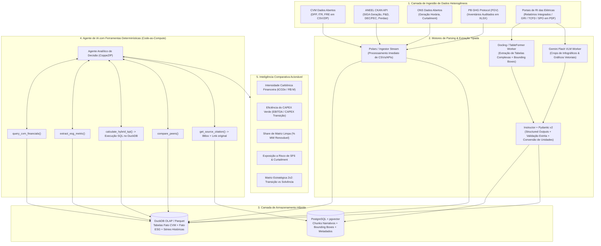

# FINDINGS: Base de Pesquisa Extensiva para Inteligência Comparativa e Transição Energética no Setor Elétrico Brasileiro

**Projeto:** CoppeZIP (Equipe ZIP)  
**Branch:** `gemini-3.7-flash`  
**Data:** Setembro de 2026  
**Problema Central:** *Como transformar os relatórios financeiros e socioambientais que as empresas do setor elétrico são obrigadas a divulgar em inteligência comparativa, capaz de revelar, de forma rápida e rastreável, como cada companhia investe, se posiciona e avança na transição energética?*

---

## SUMÁRIO EXECUTIVO & ARQUITETURA GERAL

Este documento consolida o levantamento exaustivo de dados públicos, fontes regulatórias, relatórios corporativos ESG, frameworks metodológicos, fórmulas quantitativas híbridas e a arquitetura técnica de Engenharia de Dados & IA (RAG determinístico e Tool Calling) para viabilizar o motor de inteligência competitiva da equipe ZIP.



---

## 1. FONTES DE DADOS OFICIAIS, REGULATÓRIAS E DE MERCADO

### 1.1 CVM Dados Abertos (Comissão de Valores Mobiliários)

O portal `dados.cvm.gov.br` fornece os demonstrativos contábeis e formulários cadastrais oficiais de todas as companhias abertas listadas no Brasil.

* **Diretório DFP (Demonstrações Financeiras Padronizadas - Anual):**  
  `https://dados.cvm.gov.br/dados/CIA_ABERTA/DOC/DFP/DADOS/`  
  *Padrão de URL:* `https://dados.cvm.gov.br/dados/CIA_ABERTA/DOC/DFP/DADOS/dfp_cia_aberta_{ANO}.zip` (séries de 2010 a 2025).
* **Diretório ITR (Informações Trimestrais):**  
  `https://dados.cvm.gov.br/dados/CIA_ABERTA/DOC/ITR/DADOS/`  
  *Padrão de URL:* `https://dados.cvm.gov.br/dados/CIA_ABERTA/DOC/ITR/DADOS/itr_cia_aberta_{ANO}.zip`
* **Diretório FRE (Formulário de Referência - Resolução CVM 59 e Governança):**  
  `https://dados.cvm.gov.br/dados/CIA_ABERTA/DOC/FRE/DADOS/`  
  *Padrão de URL:* `https://dados.cvm.gov.br/dados/CIA_ABERTA/DOC/FRE/DADOS/fre_cia_aberta_{ANO}.zip`
* **Cadastro Mestre de Companhias Abertas (Tabela De-Para CNPJ $\leftrightarrow$ Código CVM):**  
  `https://dados.cvm.gov.br/dados/CIA_ABERTA/CAD/DADOS/cad_cia_aberta.csv`

#### Estrutura Interna dos Arquivos e Processabilidade:
* **Formato:** Arquivos ZIP contendo múltiplos `.csv` separados por ponto e vírgula (`;`), codificação `ISO-8859-1` ou `UTF-8`.
* **Demonstrativos Consolidados Principais:**
  - `dfp_cia_aberta_DRE_con_{ANO}.csv`: Demonstração do Resultado (Receita Líquida conta `3.01`, EBIT conta `3.05`, Lucro Líquido conta `3.11`/`3.09`).
  - `dfp_cia_aberta_BPA_con_{ANO}.csv`: Balanço Ativo (Caixa `1.01.01`, Aplicações `1.01.02`, Imobilizado `1.02.02`, Concessões `1.01.08`/`1.02.04`).
  - `dfp_cia_aberta_BPP_con_{ANO}.csv`: Balanço Passivo (Empréstimos e Financiamentos CP `2.01.04`, LP `2.02.01`, Debêntures CP `2.01.05`, LP `2.02.02`).
  - `dfp_cia_aberta_DFC_MD_con_{ANO}.csv` / `DFC_MI_con_{ANO}.csv`: Fluxo de Caixa (Adições ao Imobilizado e Intangível `6.02.01`, Depreciação `6.01.01.02`).
* **Regras de Processamento:**
  - Filtrar sempre por `VERSAO == max(VERSAO)` para garantir a última versão reapresentada.
  - Filtrar `ORDEM_EXERC == 'ÚLTIMO'` para evitar duplicações de anos anteriores.
  - Se `ESCALA_MOEDA == 'MIL'`, multiplicar `VL_CONTA` por `1.000`.

#### Resolução CVM 59 (ESG no FRE) e Resolução CVM 193 (IFRS S1 / S2):
* **Item 1.9 do FRE:** Riscos climáticos físicos (seca, tempestades) e de transição (mercado de carbono, PLD).
* **Item 2.7 do FRE:** Metas formais de descarbonização, inventário GEE, adoção de GRI/SASB/TCFD e vinculação de remuneração da diretoria a metas ESG.
* **Resolução CVM 193 (IFRS S1/S2):** Vigência voluntária 2024–2025 e **obrigatória a partir de 2026** para todas as empresas abertas, com auditoria independente e formato digital estruturado em **XBRL**.

---

### 1.2 ANEEL (Agência Nacional de Energia Elétrica - Portal CKAN)

O portal `dadosabertos.aneel.gov.br` opera via CKAN API e disponibiliza dados operacionais e regulatórios de geração, transmissão e distribuição.

* **API CKAN Base:** `https://dadosabertos.aneel.gov.br/api/3/action/`
* **SIGA / BIG (Geração de Energia Elétrica Nacional):**  
  *Dataset:* `siga-sistema-de-informacoes-de-geracao-da-aneel`  
  *URL Direta CSV Diário:* `https://dadosabertos.aneel.gov.br/dataset/6d90b77c-c5f5-4d81-bdec-7bc619494bb9/resource/2f65a1b0-19b8-4360-8238-b34ab4693d55/download/siga-empreendimentos-geracao-diario.csv`  
  *Campos-Chave:* `IdeNucleoCEG` (Código único da usina), `SigTipoGeracao` (UHE, PCH, EOL, UFV, UTE, UTN), `DscFaseUsina` (Operação vs Construção), `DscOrigemCombustivel`, `MdaPotenciaOutorgadaKw`, `MdaPotenciaFiscalizadaKw`, `NomTitular`, `NumCNPJEmpreendimento`, coordenadas geográficas `NumCoordNEmpreendimento` e `NumCoordEEmpreendimento`.
* **P&D Regulatório e Eficiência Energética (Lei 9.991/2000 - 1% da ROL):**  
  *Datasets:* `projetos-de-p-d-em-energia-eletrica` e `projetos-de-eficiencia-energetica`  
  *Campos-Chave:* `CodProjeto`, `NomTema` (*Fontes Renováveis*, *Armazenamento/BESS*, *Smart Grid*, *Hidrogênio Verde*, *Eletromobilidade*), `DscFaseCadeiaInovacao`, `VlrCustoRealizado`.
* **Indicadores de Qualidade e Continuidade (DEC/FEC):**  
  *Dataset:* `indicadores-coletivos-de-continuidade-dec-e-fec`  
  *Uso:* Comparar `VlrDECapurado` vs `VlrDEClimite` e apurar compensações financeiras debitadas no EBITDA.
* **Perdas de Energia na Distribuição (Técnicas e Não Técnicas - PNT):**  
  *Dataset:* `perdas-de-energia-eletrica-distribuicao`  
  *Uso:* Quantificar furtos de energia ("gatos") que excedem a régua regulatória da ANEEL e impactam o resultado operacional.

---

### 1.3 Registro Público de Emissões do PB GHG Protocol (FGV EAESP / GVces)

O repositório oficial dos inventários de gases de efeito estufa auditados no Brasil.

* **URL da Plataforma:** `https://registrodeemissoes.fgv.br/`
* **Formato dos Dados:** Planilhas completas de cálculo em Excel (`.xlsx`) e Relatórios de Síntese em PDF.
* **Critério de Confiabilidade:** **Selo Ouro** (Inventário com Asseguração Independente de 3ª parte acreditada pelo Inmetro, ex: Bureau Veritas, KPMG, DNV, SGS, Green Domus).
* **Campos Extraíveis:**
  - Emissões brutas em $tCO_2e$ de Escopo 1, Escopo 2 (método localização e mercado) e Escopo 3.
  - **Emissões Fugitivas de $SF_6$ (Hexafluoreto de Enxofre):** Massa reposta em kg e emissão convertida com GWP de $23.500$ (AR5) ou $25.200$ (AR6). Indicador crítico para transmissoras de alta tensão.

---

### 1.4 B3, ONS e EPE

* **B3 Índices de Sustentabilidade:**
  - **ISE B3 (Índice de Sustentabilidade Empresarial):** Questionários públicos detalhados e carteira teórica em `https://iseb3.com.br/` e `https://www.b3.com.br/`.
  - **ICO2 B3 (Índice Carbono Eficiente):** Ponderação proporcional ao grau de eficiência de emissões em relação aos pares.
  - **API B3 REST:** Endpoint `https://sistemaswebb3-listados.b3.com.br/indexProxy/indexCall/GetPortfolioDay/{PAYLOAD_BASE64}`.
* **ONS (Operador Nacional do Sistema Elétrico - CKAN):**  
  *Portal:* `https://dados.ons.org.br/`  
  - `geracao-usina-2`: Geração horária verificada por usina individual.
  - `restricao_coff_eolica_detail` e `restricao_coff_fotovoltaica`: Curtailment / corte compulsório de geração renovável por restrições de escoamento na transmissão.
* **EPE & MCTI:**  
  - Balanço Energético Nacional (BEN): Séries históricas de oferta e consumo de energia.
  - Fator Médio de Emissão de GEE do SIN (MCTI/SIRENE): Fator mensal em $tCO_2/MWh$ para cálculo de Escopo 2.

---

## 2. MAPEAMENTO DAS 11 PRINCIPAIS EMPRESAS DO SETOR ELÉTRICO

| Empresa | Tickers B3 | Cód. CVM | CNPJ | Segmento Predominante | Portal de RI & Sustentabilidade | Principais Destaques de Transição |
| :--- | :--- | :--- | :--- | :--- | :--- | :--- |
| **Eletrobras** | ELET3, ELET6 | `002437` | `00.001.180/0001-26` | Geração e Transmissão | [ri.eletrobras.com](https://ri.eletrobras.com/) | >44 GW; >96% renovável; Net Zero 2030; P&D H2V Itumbiara; desinvestimento térmico fóssil. |
| **Engie Brasil** | EGIE3 | `017329` | `02.474.103/0001-19` | Geração Renovável e Transmissão | [ri.engie.com.br](https://ri.engie.com.br/) | >8,5 GW; 100% renovável após venda de carvão (Pampa Sul/Jorge Lacerda); Meta SBTi 1.5°C validada (Net Zero 2045). |
| **CPFL Energia** | CPFE3 | `018660` | `02.429.144/0001-93` | Distribuição e Geração Renovável | [ri.cpfl.com.br](https://ri.cpfl.com.br/) | ~4,4 GW geração; 14% do mercado de distribuição; foco em Smart Grids (AMI) e eletromobilidade corporativa. |
| **Neoenergia** | NEOE3 | `015539` | `01.083.200/0001-18` | Distribuição, Transmissão e Renováveis | [ri.neoenergia.com](https://ri.neoenergia.com/) | ~4,5 GW renováveis; 5 distribuidoras; emissão de Green Bonds (Sustainalytics); meta <50 gCO2/kWh em 2030. |
| **Taesa** | TAEE11 | `020257` | `07.859.971/0001-30` | Transmissão pura | [ri.taesa.com.br](https://ri.taesa.com.br/) | >14.000 km de linhas; pioneira em debêntures verdes para escoamento renovável; controle estrito de fuga de SF6 (<0,5%). |
| **Auren Energia** | AURE3 | `026654` | `39.646.410/0001-41` | Geração Renovável e Comercialização | [ri.aurenenergia.com.br](https://ri.aurenenergia.com.br/) | ~8,8 GW (pós-AES Brasil); 100% renovável (hídrica, eólica, solar); liderança no mercado livre descarbonizado. |
| **Equatorial** | EQTL3 | `020060` | `03.220.438/0001-73` | Multi-utilities (Distribuição/Transmissão) | [ri.equatorialenergia.com.br](https://ri.equatorialenergia.com.br/) | 7 distribuidoras; CAPEX focado em combate analítico a perdas não técnicas (PNT) e telemedição em massa. |
| **CEMIG** | CMIG4 | `002453` | `17.155.730/0001-64` | Integrada (Distr, Ger, Transm) | [ri.cemig.com.br](https://ri.cemig.com.br/) | ~6 GW geração 100% renovável; Net Zero 2040; P&D em hidrogênio verde e subestações digitais. |
| **COPEL** | CPLE6 | `014311` | `76.483.817/0001-20` | Integrada | [ri.copel.com](https://ri.copel.com/) | ~6,4 GW geração; desinvestimento térmico fóssil; maior programa de redes inteligentes e medidores digitais (Smart Grid Copel). |
| **ISA CTEEP** | TRPL4 | `018376` | `02.998.611/0001-04` | Transmissão pura | [ri.isacteep.com.br](https://ri.isacteep.com.br/) | ~30% da transmissão do SIN; Case BESS Registro (30 MW / 60 MWh); testes pioneiros com gás g3 substituto do SF6. |
| **Alupar** | ALUP11 | `021490` | `08.364.948/0001-38` | Transmissão e Geração Renovável | [ri.alupar.com.br](https://ri.alupar.com.br/) | Presença no Brasil e América Latina; expansão focada em lotes de transmissão para integração eólica/solar e PCHs. |

---

## 3. FRAMEWORKS, TAXONOMIAS E MÉTRICAS QUANTITATIVAS HÍBRIDAS

### 3.1 Frameworks e Taxonomias de Referência
1. **Taxonomia Sustentável Brasileira (TSB - Ministério da Fazenda):** Critérios de elegibilidade, contribuição substancial (TSC), DNSH (*Do No Significant Harm*) e salvaguardas sociais para geração renovável, transmissão (atividade habilitadora) e redes inteligentes.
2. **CVM 193 / IFRS S1 e IFRS S2:** Divulgação climática integrada com demonstrações contábeis e asseguração independente.
3. **GRI G4 Electric Utilities (EU1 a EU30) & SASB (IF-EU):** Métricas de capacidade instalada por fonte, intensidade de geração, perdas de rede e confiabilidade (SAIDI/SAIFI/DEC/FEC).
4. **SBTi Power Sector (1.5°C):** Trajetória de descarbonização física convergindo para $< 100 \text{ gCO}_2\text{e/kWh}$ até 2030 e *phase-out* do carvão.

---

### 3.2 Fórmulas Matemáticas das 9 Métricas Híbridas Centrais

$$\begin{aligned}
\text{1. Intensidade Carbônica da Receita} &= \frac{\text{Escopo 1} + \text{Escopo 2}_{[\text{Mercado}]} \text{ } (\text{tCO}_2\text{e})}{\text{Receita Líquida (DRE CVM 3.01) } (R\$ \text{ Milhões})} \quad [\text{tCO}_2\text{e} / R\$ \text{ M}] \\
\text{2. Intensidade Carbônica da Geração} &= \frac{\text{Escopo 1 da Geração } (\text{tCO}_2\text{e})}{\text{Geração Líquida Total Injetada } (\text{MWh})} \times 10^3 \quad [\text{gCO}_2\text{e} / \text{kWh}] \\
\text{3. Alinhamento de CAPEX Verde} &= \frac{\text{CAPEX em Renováveis, BESS, Smart Grids e Reforços de Linhas}}{\text{CAPEX Total Consolidado (DFC 6.02.01)}} \times 100\% \quad [\%] \\
\text{4. Retorno Marginal sobre CAPEX Verde (RoGC)} &= \frac{\Delta \text{EBITDA Operacional dos Ativos de Transição}}{\text{CAPEX Acumulado nos Ativos de Transição}} \times 100\% \quad [\% \text{ a.a.}] \\
\text{5. Share de Capacidade Limpa} &= \frac{\sum \text{kW Outorgados (Solar + Eólica + Hídrica + Biomassa)}}{\text{Total kW Outorgados (ANEEL SIGA)}} \times 100\% \quad [\%] \\
\text{6. Taxa Anual de Fuga de } SF_6 &= \frac{\text{Massa Reposta de } SF_6 \text{ nas Subestações } (\text{kg})}{\text{Massa Total no Banco de Gás Ativo } (\text{kg})} \times 100\% \quad [\% \text{ a.a.}] \\
\text{7. Taxa de Perdas Totais na Distribuição} &= \frac{\text{Energia Injetada } (\text{MWh}) - \text{Energia Faturada } (\text{MWh})}{\text{Energia Injetada } (\text{MWh})} \times 100\% \quad [\%] \\
\text{8. Intensidade de P\&D para Transição} &= \frac{\text{Investimentos em P\&D ANEEL em Descarbonização/BESS/Smart Grid}}{\text{Receita Operacional Líquida (ROL)}} \times 100\% \quad [\%] \\
\text{9. Green Debt Ratio} &= \frac{\text{Dívida Bruta em Títulos Verdes / SLBs / Debêntures Verdes}}{\text{Dívida Bruta Total (BPP CVM 2.01.04+2.01.05+2.02.01+2.02.02)}} \times 100\% \quad [\%]
\end{aligned}$$

---

### 3.3 Metodologia de Benchmarking Multissetorial (Resolução "Apples-to-Oranges")

Para comparar de forma justa empresas com perfis operacionais heterogêneos:

1. **Métricas Universais de Nível Holding:** $\text{IC}_{\text{Receita}}$, Alinhamento de CAPEX Verde ($\%$), Green Debt Ratio ($\%$), P&D Transição / EBITDA ($\%$).
2. **Métricas de Materialidade Específica:**
   - *Geradoras Puras:* $\text{IC}_{\text{Geração}} (\text{gCO}_2/\text{kWh})$, $\%$ Capacidade Limpa, Fator de Capacidade, Risco de Curtailment.
   - *Transmissoras Puras:* Taxa de Fuga de $SF_6 (\%)$, Emissões de $SF_6/\text{km}$ de linha, Parcela Variável/RAP.
   - *Distribuidoras Puras:* Perdas Não Técnicas vs Teto Regulatório ANEEL ($\Delta \% \text{PNT}$), DEC/DEC_limite, FEC/FEC_limite.
3. **Score Integrado de Transição (Sum-of-the-Parts ponderado por EBITDA):**
   $$\text{SIT}_{\text{Holding}} = \sum_{i \in \{\text{Geração, Transmissão, Distribuição}\}} \left( \frac{\text{EBITDA}_i}{\text{EBITDA}_{\text{Consolidado}}} \times Z\text{-Score}_i \right)$$
4. **Matriz Estratégica 2x2:** Posiciona as empresas entre *Velocidade da Transição* (Eixo X) vs *Sustentabilidade Financeira / Spread RoGC - WACC* (Eixo Y).

---

## 4. ARQUITETURA TÉCNICA DE ENGENHARIA DE DADOS & IA

### 4.1 Ingestão e Parsing de Documentos Complexos

* **Tabelas Complexas e PDFs Multicolunares:** O **Docling (IBM - TableFormer)** e **MinerU (magic-pdf)** são os componentes centrais para extração de tabelas com células mescladas, gerando HTML estruturado e **Bounding Boxes absolutas** `[x0, y0, x1, y1]`.
* **Crops Visuais com VLM:** Regiões com score de confiança de layout $< 0.85$ ou infográficos vetoriais são despachadas como crops de imagem em 300 DPI diretamente para o **Gemini Flash**.
* **Ingestão Direta de CSVs CVM / CKAN ANEEL:** Processamento em streaming via **Polars/DuckDB** em Python puro, eliminando completamente o uso de LLMs para dados já estruturados.

---

### 4.2 Extração Estruturada por LLM e Validação com Instructor + Pydantic v2

A extração de relatórios não estruturados utiliza o **Instructor** com esquemas Pydantic rígidos e conversão matemática determinística de unidades:

```python
from pydantic import BaseModel, Field
from enum import Enum
import hashlib

class CanonicalESGMetric(str, Enum):
    SCOPE_1 = "GHG_SCOPE_1"
    SCOPE_2_LOCATION = "GHG_SCOPE_2_LOCATION"
    SCOPE_2_MARKET = "GHG_SCOPE_2_MARKET"
    SCOPE_3 = "GHG_SCOPE_3"
    SF6_EMISSIONS = "GHG_SF6_EMISSIONS"

class RawExtraction(BaseModel):
    canonical_metric: CanonicalESGMetric
    raw_metric_name: str
    raw_value: float
    raw_unit: str  # ex: 'mil tCO2e', 'kt', 'kg', 'tCO2'
    reporting_year: int
    raw_snippet: str
    page_number: int

class NormalizedESGMetric(BaseModel):
    metric_id: str
    company_ticker: str
    canonical_metric: CanonicalESGMetric
    reporting_year: int
    normalized_value_tco2e: float  # Conversão determinística em Python
    document_hash: str
    page_number: int
    bounding_box: list[float]
    raw_snippet: str

    @classmethod
    def from_raw(cls, raw: RawExtraction, ticker: str, doc_hash: str, bbox: list[float]):
        unit = raw.raw_unit.lower().strip()
        val = raw.raw_value
        
        # Fator de conversão estritamente determinístico
        if unit in ["tco2", "tco2e", "toneladas", "t"]:
            factor = 1.0
        elif unit in ["ktco2", "ktco2e", "mil tco2", "mil tco2e"]:
            factor = 1_000.0
        elif unit in ["mtco2", "mtco2e", "milhões de tco2e"]:
            factor = 1_000_000.0
        elif unit in ["kgco2", "kgco2e", "kg"]:
            factor = 0.001
        else:
            raise ValueError(f"Unidade não suportada: {raw.raw_unit}")
            
        unique_id = hashlib.sha256(f"{ticker}_{raw.canonical_metric}_{raw.reporting_year}_{doc_hash}".encode()).hexdigest()[:16]
        return cls(
            metric_id=unique_id,
            company_ticker=ticker,
            canonical_metric=raw.canonical_metric,
            reporting_year=raw.reporting_year,
            normalized_value_tco2e=val * factor,
            document_hash=doc_hash,
            page_number=raw.page_number,
            bounding_box=bbox,
            raw_snippet=raw.raw_snippet
        )
```

---

### 4.3 Motor de Rastreabilidade e Cálculo Determinístico (Code-as-Compute)

> [!IMPORTANT]
> **Princípio Zero-Hallucination:** O LLM **nunca executa cálculos aritméticos** no texto de resposta. Ele apenas orquestra chamadas de ferramentas (*Tool Calling*) e formula queries SQL executadas pelo motor analítico **DuckDB**.

Toda métrica calculada carrega metadados imutáveis de proveniência:
1. Hash SHA-256 do arquivo PDF/CSV de origem;
2. Número exato da página;
3. Coordenadas de Bounding Box `[x0, y0, x1, y1]`;
4. Citação literal do trecho/tabela original;
5. Query SQL exata que originou o cálculo.

---

### 4.4 Conjunto de Ferramentas do Agente (AI Tools)

```python
def query_cvm_financials(ticker: str, year: int, account_code: str) -> dict:
    """Consulta DFP/ITR estruturada no DuckDB (ex: 3.01 para Receita Líquida)."""
    ...

def extract_esg_metric(ticker: str, canonical_metric: str, year: int) -> dict:
    """Recupera a métrica ESG normalizada com Bounding Box e citação de página."""
    ...

def calculate_hybrid_kpi(ticker: str, year: int, kpi_name: str) -> dict:
    """Executa o cálculo analítico no DuckDB cruzando CVM + ESG e retorna a linhagem completa."""
    ...

def compare_peers(tickers: list[str], metric: str, year_range: tuple[int, int]) -> dict:
    """Gera matriz comparativa e ranking normalizado entre pares setoriais."""
    ...

def get_source_citation(metric_id: str) -> dict:
    """Retorna o recorte visual, página e documento para verificação pelo usuário."""
    ...
```

---

## 5. CONCLUSÕES E PRÓXIMOS PASSOS DO PROJETO COPPEZIP

1. **Pipeline Completo Mapeado:** Todos os endpoints da CVM, ANEEL, PB GHG Protocol, ONS e B3 estão catalogados com scripts de automação.
2. **Auditabilidade Total:** A estrutura de Bounding Boxes e execução determinística no DuckDB elimina riscos de alucinações matemáticas ou contábeis.
3. **Branch e Código:** Os achados estão persistidos no branch `gemini-3.7-flash` para dar suporte à implementação dos módulos de software do projeto.
