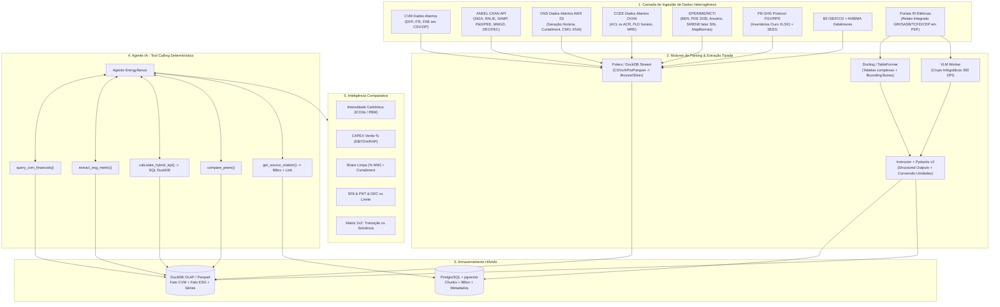

# FINDINGS: Base de Pesquisa Extensiva para Inteligência Comparativa e Transição Energética no Setor Elétrico Brasileiro

**Projeto:** EnergyNexus (Equipe ZIP)  
**Branch:** `muse-spark-1.2-contributor-free`  
**Data:** 13 de Setembro de 2026  
**Problema Central:** *Como transformar os relatórios financeiros e socioambientais que as empresas do setor elétrico são obrigadas a divulgar em inteligência comparativa, capaz de revelar, de forma rápida e rastreável, como cada companhia investe, se posiciona e avança na transição energética?*

> **Metodologia:** 5 subagentes paralelos disparados em 13/09/2026 varreram via `websearch`/`webfetch` com ano-base 2026 os portais canônicos CVM, ANEEL, EPE, ONS, CCEE, MME, MCTI, IBAMA/ANA, B3, FGV, INPE, IBGE, BNDES, World Bank, IRENA, Ember, IEA, etc. **Todas as URLs abaixo foram verificadas ativas em 13/09/2026** — nenhum link inventado. Escala Processabilidade 1–5: `5=API/CSV/Parquet estruturado + dicionário` → `1=PDF escaneado/imagem`.

---

## SUMÁRIO EXECUTIVO & ARQUITETURA GERAL

Este documento consolida **>100 fontes verificadas** (72 só no CKAN ANEEL + 54 CVM + 22 EPE/ONS/CCEE + 18 socioambientais + 26 complementares) para o motor de inteligência competitiva da equipe ZIP. Cobertura **2010–2026**, latência **horária (ONS) a anual (BEN/PDE)**, granularidade **por usina/CEG, por CNPJ/CVM, por distribuidora, por município**.

**Achados críticos 2026:**
1. **CVM Res. 244/2026 revogou obrigatoriedade IFRS S1/S2 (CBPS 01/02)** — virou voluntário "pratique ou explique" a partir de 01/01/2027 (Fonte: `conteudo.cvm.gov.br/legislacao/resolucoes/anexos/200/resol244.pdf`). Mas **FRE Seção 1.9 (Res. 59) continua obrigatório** e é a fonte ESG universal.
2. **PDE 2035 aprovado Portaria MME 923/2026 (DOU 02/07/2026)** — +110 GW até 2035 (367 GW total), MMGD 78,1 GW cenário ref., R$ 3,5 tri investimento.
3. **ANEEL REN 1.161/1.162 de 02/06/2026 regulamenta Sistemas de Armazenamento (SAE)** — sazonalidade do curtailment (22,9% eólica, 29,5% solar em jul/2026) vira KPI central.
4. **Trifecta rastreável:** SIGA (oferta centralizada) + MMGD (GD 50,47 GW jul/2026) + PDD/SIGET (CAPEX rede R$ 257,9 bi 2026-30) + ONS constrained-off diário = diagnóstico completo gargalo fio vs renovável.



---

## 1. FONTES REGULATÓRIAS ANEEL (Portal Dados Abertos CKAN)

**Portal raiz:** `https://dadosabertos.aneel.gov.br` — 72 conjuntos (`organizacao=agencia-nacional-de-energia-eletrica`) + Portal Relatórios Abertos `https://portalrelatorios.aneel.gov.br`

**Padrão API CKAN:**
```bash
https://dadosabertos.aneel.gov.br/api/3/action/package_list
https://dadosabertos.aneel.gov.br/api/3/action/package_show?id=siga-sistema-de-informacoes-de-geracao-da-aneel
https://dadosabertos.aneel.gov.br/api/3/action/datastore_search?resource_id=11ec447d-698d-4ab8-977f-b424d5deee6a
https://dadosabertos.aneel.gov.br/dataset/<pkg>/resource/<id>/download/<file.csv>
```

### 1.1 Tabela Mestre — 19 Fontes Obrigatórias Verificadas (set/2026)

| # | Nome Oficial | URL Canônica | Formato | Freq. | Granularidade | Proc. | Relevância |
|---|---|---|---|---|---|---|---|
| 1 | **SIGA — Sistema Informações Geração** | `https://dadosabertos.aneel.gov.br/dataset/siga-sistema-de-informacoes-de-geracao-da-aneel` <br> CSV: `.../resource/11ec447d-698d-4ab8-977f-b424d5deee6a/download/siga-empreendimentos-geracao.csv` <br> Diário: `.../resource/2f65a1b0-19b8-4360-8238-b34ab4693d55/download/siga-empreendimentos-geracao-diario.csv` (8 MiB, 26/08/2026) | CSV, XML, API CKAN + Dic PDF | Mensal + Diária | Por CEG/usina, UF, fonte (solar/eólica/hídrica/térmica), pot. outorgada/fiscalizada | **5** | **ALTA** — parque 215.936 MW (85% renovável 01/01/2026), pipeline 9.142 MW 2026 |
| 2 | **RALIE — Acompanhamento Expansão Oferta** | `https://dadosabertos.aneel.gov.br/dataset/ralie-relatorio-de-acompanhamento-da-expansao-da-oferta-de-geracao-de-energia-eletrica` | CSV/ZIP/Parquet + Painel `portalrelatorios.aneel.gov.br/rit` | Mensal (até dia 15) | Por usina/CEG + UG (pot. unitária, datas operação prevista) | **5** | **ALTA** — atrasos obras, gargalos implantação renovável |
| 3 | **SAMP — Mercado Distribuição** | `https://dadosabertos.aneel.gov.br/dataset/samp` <br> 2026: `.../resource/56f1c242-5017-4cef-a365-0a96fffb0f2b/download/samp-2026.csv` (188,6 MiB, 18/08/2026) | CSV/Parquet/PDF/API | Mensal | Por distribuidora, classe/subgrupo, UF, mês (consumo MWh, demanda kW, nº consumidores, receita) | **5** | **ALTA** — fuga GD/mercado livre, eletrificação |
| 4 | **SAMP-Balanço** | `https://dadosabertos.aneel.gov.br/dataset/samp-balanco` | CSV/Parquet/PDF | Mensal | Por distribuidora, disponibilidade vs requisito | **5** | **ALTA** — perdas, dimensionamento GD/armazenamento |
| 5 | **Componentes Tarifárias (TE+TUSD)** | `https://dadosabertos.aneel.gov.br/dataset/componentes-tarifarias` `.../resource/e8717aa8-2521-453f-bf16-fbb9a16eea39/download/componentes-tarifarias-2026.csv` (253 MiB) | CSV/Parquet/API | Semanal | Por distribuidora, subgrupo, classe, modalidade, componente (Parcela A/B, Fio B) | **5** | **MÉDIA-ALTA** — subsídio cruzado, sinal GD |
| 6 | **Tarifas Homologadas** | `https://dadosabertos.aneel.gov.br/dataset/tarifas-distribuidoras-energia-eletrica` | CSV/XML/PDF/API | Semanal (05/09/2026) | Por distribuidora, posto tarifário, resolução | **5** | MÉDIA — competitividade solar vs rede |
| 7 | **DEC/FEC Indicadores Continuidade** | `https://dadosabertos.aneel.gov.br/dataset/indicadores-coletivos-de-continuidade-dec-e-fec` (17 recursos, parquet 2020-2029) | CSV/ZIP/Parquet/PDF | Mensal (05/09/2026) | Por conjunto UC (subárea SE AT/MT), distribuidora | **5** | **ALTA** — integração intermitente, smart grid; DEC 9,30h em 2025 (-9,2%) |
| 8 | **Ranking Continuidade DGC** | `https://www.gov.br/aneel/pt-br/centrais-de-conteudos/relatorios-e-indicadores/distribuicao/ranking-de-continuidade/2025` + Nota Técnica 65/2026-STD | PDF/HTML + XLS (proc 48500.004212/2026-07) | Anual (15/04/2026) | Por distribuidora (grande >400k UC e pequena) | **3** | MÉDIA — CAPEX qualidade, resiliência climática |
| 9 | **P&D Energia Elétrica (1% ROL Lei 9.991/2000)** | `https://dadosabertos.aneel.gov.br/dataset/projetos-de-p-d-em-energia-eletrica` (`proj-ped-energia-eletrica.csv` 01/09/2026) | CSV/PDF/API | Mensal (desde 2008) | Por projeto/empresa, tema (H2, armazenamento, captura carbono, digital), valor | **5** | **ALTA** — R$ bi em inovação; Boletim mensal PDI |
| 10 | **PEE — Eficiência Energética (1% ROL)** | `https://dadosabertos.aneel.gov.br/dataset/projetos-de-eficiencia-energetica` + `https://siase.aneel.gov.br/WebOpee/` | CSV/PDF | Mensal (desde 1999) | Por distribuidora, tipologia, kW retirada ponta, GWh/ano economizado, R$ | **5** | **ALTA** — 9.000 GWh/ano declarados; R$12,2 bi verificados |
| 11 | **Resultado Leilões Geração/Transmissão** | `https://dadosabertos.aneel.gov.br/dataset/resultado-de-leiloes` (`resultado-leiloes-geracao.csv`, `resultado-leiloes-transmissao.csv`) | CSV/PDF | Mensal (01/09/2026) | Por leilão/edital, empreendimento, deságio, RAP, garantia física | **5** | **ALTA** — LRCAP 2026: 18,97 GW, R$64,5 bi, deságio 5,52%; baterias stand-alone dez/2026 |
| 12 | **MMGD — Mini/Micro Geração Distribuída** | `https://dadosabertos.aneel.gov.br/dataset/relacao-de-empreendimentos-de-geracao-distribuida` (`empreendimento-geracao-distribuida.zip/parquet` 04/09/2026) | CSV ZIP/Parquet/API | Diária | Por UC/empreendimento, distribuidora, fonte (99% solar FV), potência kW, município, data conexão | **5** | **ALTA** — >50 GW solar jul/2026; 3 mi UCs |
| 13 | **Atendimento Pedidos Conexão MMGD (Lei 14.300)** | `https://dadosabertos.aneel.gov.br/dataset/atendimento-mmgd-mini-e-micro-geracao-distribuida` | CSV/Parquet/PDF | Mensal (01/09/2026) | Por pedido, distribuidora, prazo, motivo reprovação | **4** | **ALTA** — filas, negativas, sinal reforço BT/MT |
| 14 | **PDD — Plano Desenvolvimento Distribuição** | `https://dadosabertos.aneel.gov.br/dataset/pdd` (`pdd-distribuicao-aneel.csv` 779 KiB 26/06/2026) + `https://portalrelatorios.aneel.gov.br/indicadoresDistribuicao/planoDesenvolvimentoDistribuicao` | CSV/API | Anual (prazo 30/04) | Por distribuidora, categoria Expansão/Melhoria/Renovação, tensão, município | **5** | **ALTA** — CAPEX futuro R$40,94 bi realizados 2025 + R$257,93 bi 2026-30 (60% expansão) |
| 15 | **INDGER — Indicadores Gerenciais Distribuição** | `https://dadosabertos.aneel.gov.br/dataset/indger-indicadores-gerenciais-da-distribuicao` (6 CSVs 05/09/2026) | CSV/ZIP/Parquet/PDF | Mensal | Por distribuidora, alimentador, SE, município | **5** | MÉDIA-ALTA — hosting capacity local p/ GD/VEs |
| 16 | **SIGET + RAP Transmissão** | `https://dadosabertos.aneel.gov.br/dataset/sistema-de-gestao-da-transmissao-siget` (25 recursos, 31/08/2026) + `https://portalrelatorios.aneel.gov.br/luznatarifa/relrap` | CSV/PDF/API | Diária | Por contrato/empreendimento/obra/módulo (linha/SE), agente, resolução | **5** | **ALTA** — 356 contratos / 258 transmissoras / R$54,95 bi RAP ciclo 2026-27 (+9,41%) |
| 17 | **Fiscalização — Auto Infração / TIPE / Termo Notificação** | `https://dadosabertos.aneel.gov.br/dataset/auto-de-infracao` | CSV/XML | Mensal | Por agente, CNPJ, objeto, penalidade, valor | **4** | MÉDIA — risco regulatório/ESG, barragens |
| 18 | **TFSEE — Taxa Fiscalização** | `https://dadosabertos.aneel.gov.br/dataset/tfsee` (6 MiB 09/08/2026) | CSV/PDF/API | Diária | Por agente, modalidade, benefício econômico (0,4%) | **5** | BAIXA-MÉDIA — valuation, remuneração |
| 19 | **RIT / BMP / DCE / PAC — Contábil Regulatório** | `https://portalrelatorios.aneel.gov.br/rit` (workspaces SFF) | Power BI / CSV exportável | Trimestral (RIT) + Mensal (BMP) | Por concessionária, conta MCSE | **3-4** | **ALTA** — CAPEX realizado regulatório (base remuneração); gap aberto exige raspagem Power BI |

**Extensões ANEEL (não-CKAN mas regulatórias):**
- **Agentes Setor Elétrico / Geração:** `https://dadosabertos.aneel.gov.br/dataset/agentes-do-setor-eletrico` + `agentes-de-geracao-de-energia-eletrica` — CSV mensal, mapeia grupo econômico (Eletrobras, Engie, Equatorial).
- **Atos Outorgas Geração:** `https://dadosabertos.aneel.gov.br/dataset/atos-de-outorgas-de-geracao` — CSV diário, inclui **REN 1.161/1.162 SAE 2026**.
- **Subsidiômetro + CDE Custeio + Beneficiários:** `https://portalrelatorios.aneel.gov.br/luznatarifa/subsidiometro` + `https://dadosabertos.aneel.gov.br/dataset/beneficiarios-da-cde` — Power BI + ZIP/CSV.
- **Bandeiras Tarifárias:** `https://dadosabertos.aneel.gov.br/dataset/bandeiras-tarifarias` — CSV/PDF mensal desde 2015 (amarela R$1,885/100kWh ago/2026).
- **PRORET:** `https://www.gov.br/aneel/pt-br/centrais-de-conteudos/procedimentos-regulatorios/proret` — PDF módulos (WACC, Fator X).
- **Interrupções DETALHADA (Parquet novo!):** `https://dadosabertos.aneel.gov.br/dataset/interrupcoes-de-energia-eletrica-nas-redes-de-distribuicao/resource/cf722d0b-aa04-4681-bcd9-8a737e857182/download/interrupcoes-energia-eletrica-2026.parquet` (160,7 MiB, Parquet).
- **BDGD — Base Geográfica Distribuição:** `https://dadosabertos.aneel.gov.br/dataset/bdgd` — GDB/Shapefile/CSV anual, georreferenciada por alimentador/transformador/UC/GD (API não-oficial `bdgd.aneel.gov.br`).
- **Ouvidoria ANEEL:** `https://dadosabertos.aneel.gov.br/dataset/ouvidoria-setorial-aneel` — CSV 2026.

---

## 2. FONTES FINANCEIRAS OBRIGATÓRIAS — CVM / B3 / ANBIMA

**Portal raiz CVM:** `https://dados.cvm.gov.br` — CKAN API + PDA CVM 2026-2028 (54 conjuntos + 8 novos até 2028, piloto API pública em 2026)

```bash
# API CKAN CVM
curl "https://dados.cvm.gov.br/api/3/action/package_show?id=cia_aberta-doc-dfp" | jq '.result.resources[] | {name,url,format}'
wget https://dados.cvm.gov.br/dados/CIA_ABERTA/DOC/DFP/DADOS/dfp_cia_aberta_2026.zip
```

### 2.1 Tabela Mestre — 18 Fontes CVM/B3

| # | Fonte | Nome Oficial | URL Canônica | Formato | Freq. | Granularidade | Proc. | Relevância |
|---|---|---|---|---|---|---|---|---|
| 1 | **DFP** | Demonstrações Financeiras Padronizadas | `https://dados.cvm.gov.br/dataset/cia_aberta-doc-dfp` <br> Direto: `https://dados.cvm.gov.br/dados/CIA_ABERTA/DOC/DFP/DADOS/dfp_cia_aberta_2026.zip` | CSV ZIP (`BPA/BPP/DRE/DRA/DFC/DMPL/DVA`) + XML Empresas.NET + PDF auditado | Anual (até 31/03, reapresentações semanais seg 02:10 UTC) | Por CVM código, IND/CON | **5** | **★★★★★** — CAPEX, provisões ambientais, dívida verde |
| 2 | **ITR** | Informações Trimestrais | `https://dados.cvm.gov.br/dataset/cia_aberta-doc-itr` <br> `itr_cia_aberta_2026.zip` | CSV ZIP + XML + PDF | Trimestral (45 dias, semanal) | Por cia, IND/CON | **5** | **★★★★★** — antecipa 9 meses vs DFP |
| 3 | **FRE** | Formulário de Referência | `https://dados.cvm.gov.br/dataset/cia_aberta-doc-fre` <br> `fre_cia_aberta_2026.zip` (50+ CSVs) | CSV ZIP + ZIP | Anual + eventual 7 dias úteis | Por cia | **5** (num) /3 (texto) | **★★★★★** — JOIA: seção 10.x CAPEX previsto, 4.1 risco climático, 1.9 ESG |
| 4 | **FCA** | Formulário Cadastral | `https://dados.cvm.gov.br/dataset/cia_aberta-doc-fca` | CSV (9 arquivos) | Semanal (24/08/2026) | Por cia | **4** | ★★ — auditor, DRI, valores mobiliários |
| 5 | **IPE** | Periódicas/Eventuais (índice PDFs) | `https://dados.cvm.gov.br/dataset/cia_aberta-doc-ipe` <br> `ipe_cia_aberta_2026.zip` (`LINK_ARQUIVO` p/ PDF) | CSV índice + PDF/ZIP | Contínua (diária) | Por documento | **2** (PDF) /5 (índice) | **★★★★** — Notas Explicativas (Imobilizado por fonte), Relatório Adm, Fato Relevante debênture verde |
| 6 | **ICBGC** | Informe Cód. Bras. Governança | `https://dados.cvm.gov.br/dataset/cia_aberta-doc-cgvn` | CSV ZIP | Anual (7 meses após) | Por cia | **4** | ★★★ — conselho, comitê sustentabilidade |
| 7 | **CAD** | Informação Cadastral (mestre) | `https://dados.cvm.gov.br/dataset/cia_aberta-cad` <br> Direto: `https://dados.cvm.gov.br/dados/CIA_ABERTA/CAD/DADOS/cad_cia_aberta.csv` (08/09/2026) | CSV único diário | Por CNPJ/Cód CVM | **5** | ★★★ — filtro `SETOR_ATIV==Energia Elétrica` ~60-70 CNPJs |
| 8 | **CBPS/S1/S2** | Relato Sustentabilidade (Res 193→244) | `https://conteudo.cvm.gov.br/legislacao/resolucoes/resol193.html` + `.../resol244.pdf` | PDF + futuro XBRL | Voluntário `pratique ou explique` desde 29/05/2026 | Por cia consolidada | **2→4** | **★★★★★** — Escopo1/2/3, cenários 1.5°C, capex transição; asseguração razoável se optar |
| 9 | **Ofertas** | Ofertas Públicas (400/160/476) | `https://dados.cvm.gov.br/dataset/oferta-distrib` <br> `oferta_distribuicao.zip` | CSV diário (03/09/2026) | Por oferta/série | **5** | **★★★★★** — debêntures incentivadas Lei 12.431/14.801; setor energia 33,7% volume |
| 10 | **RAD/Empresas.NET** | Download Múltiplo XML | `https://www.rad.cvm.gov.br/ENETWEB/shared/login.aspx` + Nota Técnica CVM download múltiplo | XML + XLSX especificação | Tempo real | Por formulário | **4** | **★★★★★** — XML oficial DFP/ITR/FRE validável |
| 11 | **B3 Classificação** | Classificação Setorial + IEE | `https://www.b3.com.br/pt_br/produtos-e-servicos/negociacao/renda-variavel/acoes/consultas/classificacao-setorial/` + `.../indice-de-energia-eletrica-iee-b3.htm` | HTML + CSV download | Semanal (classif.) / Quadrimestral IEE | Por ticker | **3** | **★★★★★** — universo comparável IEE ~18 ativos (AXIA3, EGIE3, CPFE3, NEOE3, etc) |
| 12 | **B3 Listadas** | Empresas Listadas | `https://sistemaswebb3-listados.b3.com.br/listedCompaniesPage/` | HTML + JSON privado | Diária | Por emissor | **3** | ★★★★ — mapa Ticker↔CNPJ↔CVM |
| 13 | **ANBIMA/SND** | Debêntures Incentivadas | `https://data.anbima.com.br/busca/debentures` + `https://data.anbima.com.br/publicacoes/boletim-de-debentures-incentivadas-e-de-infraestrutura` + SND `https://debentures.prd.anbima.com.br/exploreosnd/exploreosnd.asp` | CSV/XLS/HTML | Mensal (até 8º dia útil) + diário preços | Por série | **4** | **★★★★★** — spread incentivado, greenium, use of proceeds |
| 14 | **Gov Debêntures** | Debêntures Incentivadas MInfra | `https://dados.transportes.gov.br/dataset/debentures-incentivadas` | CSV semestral | Por debênture/portaria | **4** | ★★★★ — complementa CVM com infra não-listada |
| 15 | **B3 Proventos** | Proventos/Eventos Corp. | IPE `Eventos Corporativos/Aviso a Acionistas` + B3 `Formulario de Proventos.pdf` | Eventual D+1 | Por ticker/evento | **4** | ★★★ — payout vs reinvest verde (ex: TAEE3 >90% vs AURE reinvest) |
| 16 | **PDA CVM 2026-28** | Plano Dados Abertos CVM | `https://www.gov.br/cvm/pt-br/acesso-a-informacao-cvm/dados-abertos/pda-cvm-2026-2028.pdf` | CKAN JSON + CSV/ZIP + futura API pública | Ver dataset | Todos | **5** | Meta — +8 novos até 2028 (FIAGRO, Crowdfunding) |
| 17 | **XBRL/Leiautes** | Taxonomia + Leiautes ENET | `https://sistemas.cvm.gov.br/port/ciasabertas/Layout_Compactado.zip` + `.../Leiaute_de_Formularios_do_EmpresasNET.asp` | XML/XLSX | Sob demanda | Por quadro/conta | **3** | ★★★★ — hierarquia CD_CONTA (1.02.03 Imobilizado) |
| 18 | **B3 Market Data** | APIs / Cotações | `https://developers.b3.com.br/apis` + `https://www.b3.com.br/pt_br/market-data-e-indices/servicos-de-dados/market-data/cotacoes/` | JSON REST + CSV histórico | Intraday/Diário | Por ticker | **3** | ★★ — beta, market cap p/ normalizar CAPEX |

**Detalhe DFP/ITR — como extrair inteligência transição:**
- **CAPEX Renovável:** `BPA 1.02.03 Imobilizado` + `1.02.02 Intangível (concessão)` + `DFC-MI 6.02 Aquisições` + Notas Explicativas IPE nº 12-15 (tabela Imobilizado por tipo usina: hidro/eólica/solar/térmica). Filtrar notas por `eólica|solar|PCH|UTE`.
- **Dívida Verde:** `BPP 2.01.04/2.02.01 Empréstimos` + notas 16-19 (debêntures BNDES) cruzado com `oferta_distribuicao.csv` (`Tipo=Debênture Incentivada Lei 12.431 art.2`).
- **Provisões Ambientais:** `BPP 2.01.06/2.02.04` + conta `2.02.04.01.02 Provisão desmantelamento`.
- **FRE joia:** 50+ CSVs; arquivos chave `fre_cia_aberta_investimento` (seção 10.x, CAPEX previsto), `fre_cia_aberta_fator_risco` (4.1/4.2 ESG), `fre_cia_aberta_comentario_analise` (2.10.d). **FRE texto livre requer LLM**, mas campos numéricos são 5/5.

**CBPS 2026 — ponto crítico:** Res. 193 previa obrigatório a partir de 01/01/2026 (exercício 2026, publicação 2027). **Res. 244/2026 revogou**. Agora: voluntário com declaração sem reservas + **asseguração razoável auditor CVM** + compromisso mínimo 3 exercícios + quem não publicar a partir de **01/01/2027 deve justificar via Comunicado ao Mercado**. Ofício SNC/SEP 02/2026 proíbe "alinhado/inspirado ISSB" sem conformidade total. **CMN 5.185/2024 mantém obrigatório para bancos S1/S2 (Itaú, Bradesco, BB) — assimetria.**

**B3 ISE/ICO2 2026:** ISE 69 cias (engie 5ª, CPFL 7ª, Copel 10ª; corte 65,66); ICO2 65 cias IBrA (+4 vs 2025), 75% melhoraram eficiência tCO2e/receita.

---

## 3. FONTES EPE / ONS / CCEE / MME (Planejamento & Operação)

### 3.1 EPE/MME — Planejamento Indicativo (8 fontes)

| # | Nome | URL Canônica | Formato | Freq. | Granularidade | Proc. | Relevância |
|---|---|---|---|---|---|---|---|
| 1 | **PDE 2035** (aprovado) | `https://www.epe.gov.br/pt/publicacoes-dados-abertos/publicacoes/plano-decenal-de-expansao-de-energia-2035` + MME `https://www.gov.br/mme/pt-br/assuntos/secretarias/sntep/publicacoes/plano-decenal-de-expansao-de-energia` | PDF Final ~400p + Painel XLSX + ZIP modelos NEWAVE/MDI | Anual (Portaria 923 30/06/2026, DOU 02/07/2026) | 2026-2035 por fonte (hidro 3.622 MW, PCH/CGH 4.314 MW, eólica 14.487 MW, solar, biomassa), subsistema, emissões | **3/4** | **MÁXIMA** — única expansão indicativa oficial; 255→367 GW (+110 GW), 939 TWh 2035 |
| 2 | **PDE 2034** | `https://www.epe.gov.br/pt/publicacoes-dados-abertos/dados-abertos/dados-abertos-do-painel-de-consolidacao-do-plano-decenal-de-expansao-de-energia-2034` | PDF + XLSX Dados Brutos | Anual | — | **4** | Alta — série histórica benchmark |
| 3 | **BEN 2026 (ano base 2025)** | Dados: `https://www.epe.gov.br/pt/publicacoes-dados-abertos/dados-abertos/dados-abertos-do-balan%C3%A7o-energ%C3%A9tico-nacional-ben` <br> Livro: `https://dashboard.epe.gov.br/apps/livro-ben/livro` <br> Final: `https://www.epe.gov.br/pt/imprensa/noticias/epe-publica-o-relatorio-final-do-balanco-energetico-nacional-2026` (02/07/2026) | PDF Síntese+Final + **XLSX Matriz 1970-2025 (tidy)** + Dicionário | Anual (jun/jul) | Nacional por energético, setor, 1970-2025 | **5** | **MÁXIMA** — 49,5% renov. OIE, 88,2% matriz elétrica, MMGD 41 TWh (5,6% 2024) |
| 4 | **PNE 2050** | `https://www.gov.br/mme/pt-br/assuntos/secretarias/sntep/publicacoes/plano-nacional-de-energia/plano-nacional-de-energia-2050` + Painel EPE | PDF + HTML | Quinquenal | Cenários até 2050 (GD 25-75 GW, eólica offshore, H2) | **2-3** | Alta — cenários neutralidade |
| 5 | **Anuário Est. Energia Elétrica 2026** | `https://www.epe.gov.br/pt/publicacoes-dados-abertos/publicacoes/anuario-estatistico-de-energia-eletrica` <br> Livro: `https://dashboard.epe.gov.br/apps/anuario-livro/livro/pt/autoria.html` | Workbook XLSX 1811 KB + HTML + Factsheet 777 KB | Anual (03/06/2026) | Mensal/anual por classe/UF/subsistema, livre vs cativo | **4** | Máxima — base demanda (resid. 254 TWh, comerc 179, industr 272 TWh em 2035 PDE) |
| 6 | **Resenha Mensal Consumo** | `http://epe.gov.br/pt/publicacoes-dados-abertos/publicacoes/consumo-de-energia-eletrica` (notícia 31/08/2026: 46.841 GWh jul/2026 +3,7%) | XLS (série 2004-) + PDF | Mensal D+45 | Nacional/regional/subsistema/classe | **4** | Alta — nowcasting demanda |
| 7 | **WEBMAP EPE** | App: `https://gisepeprd2.epe.gov.br/WebMapEPE` + `https://gisepeprd2.epe.gov.br/webmapepe` | WMS, Shapefile/GeoJSON, GeoTIFF, CSV | Contínua | Pontual: UHE/PCH/eólica/solar/térmica/LT/SE, UC, TI, Quilombolas | **5** | Máxima — siting renovável, socioambiental |
| 8 | **LENS + Leilões EPE** | Integrado PDE 2035 + `https://www.epe.gov.br/pt/publicacoes-dados-abertos/publicacoes` (filtragem Leilões) | Notas Técnicas PDF + planilhas habilitação + shapefiles | Por leilão (A-3/A-5, LRCAP BESS dez/2026: 6.091 projetos 296 GW) | Empreendimento | **3** | Alta — pipeline real contratado vs indicativo |
| 9 | **Atlas Transição Energética 2026** | MME/EPE 18/08/2026 | PDF atlas + base estadual | Anual | Por UF, políticas/vocação regional | **3** | Alta — diferenciação regional |

### 3.2 ONS — Operação SIN (7 fontes canônicas)

**Portal mãe:** `https://dados.ons.org.br` — CKAN, CC-BY, espelho AWS `https://registry.opendata.aws/ons-opendata-portal/` (`s3://ons-aws-prod-opendata/` sa-east-1, sem credencial, atualização diária 12h e 19h) + novo **MCP IA** `Conecte sua IA`.

| # | Nome | URL | Formato | Freq. | Granularidade | Proc. | Relevância |
|---|---|---|---|---|---|---|---|
| 1 | **Balanço Energia Subsistemas** | `https://dados.ons.org.br/dataset/balanco-energia-subsistema` (`BALANCO_ENERGIA_SUBSISTEMA_2026.xlsx` S3) | XLSX/CSV/Parquet | **Horária** | Subsistema SE/CO, S, NE, N | **5** | Máxima — fator capacidade renovável real |
| 2 | **Geração/Carga Verificada/Programada** | `https://dados.ons.org.br/dataset?tags=Gera%C3%A7%C3%A3o` + Carga | CSV/JSON/Parquet/API | **Semi-horária (DESSEM)** | Por usina Tipo I/II-B/II-C, área carga | **5** | Máxima — despacho renovável, curtailment implícito |
| 3 | **Hidrologia ENA/EAR Reservatórios** | `https://dados.ons.org.br/dataset/ena-diario-por-subsistema` | XLSX/CSV/Parquet | **Diária/Mensal** | Por reservatório/bacia | **5** | Máxima — segurança hídrica |
| 4 | **CMO Semi-Horário** | `https://dados.ons.org.br/dataset/cmo-semi-horario` | CSV/Parquet/JSON | **Semi-horária** | Por barra/subsistema (ex ago/2026 SE/CO R$137,71/MWh, N R$581,48/MWh) | **5** | Alta — proxy PLD, sinal armazenamento |
| 5 | **IPDO + PMO** | `https://www.ons.org.br` AcervoDigit + `RELATORIO-PMO-15_08_26 a 21_08_26.pdf` | PDF | Diária/semanal | SIN + subsistemas | **3** | Alta — despacho térmico por modalidade |
| 6 | **Curtailment Eólico/Solar detalhado** | Eólico: `https://dados.ons.org.br/dataset/restricao_coff_eolica_detail` <br> Solar: `https://dados.ons.org.br/dataset/restricao_coff_fotovoltaica` <br> Recursos: `Restricoes_coff_Eolicas_Detalhamento-2026-08`, `Restricoes_coff_fotovoltaica-2026-09` | CSV/Parquet/XLSX/JSON | **Diária (horária agregada)** | Por usina, causa (energética vs elétrica/confiabilidade) | **5** | **MÁXIMA** — 22,9% eólica /29,5% solar jul/2026; PEN 2026-30 projeta 2-3 GW médios, 40 GW pico |
| 7 | **Previsão vs Programado Eólico/Solar + Intercâmbio + PEN 2026-2030** | `https://dados.ons.org.br/dataset/programacao_x_previsao` + `https://www.ons.org.br/paginas/energia-no-futuro/suprimento-energetico` (PEN Sumário 31/07/2026) | CSV/Parquet | Horária/diária | Por usina | **5** | Alta — erro previsão, integração INPE/CPTEC |

### 3.3 CCEE — Mercado & Preço (7 fontes)

**Portal:** `https://dadosabertos.ccee.org.br` — CKAN CC-BY, MS+22du (22 dias úteis mês subseq.).

| # | Nome | URL | Freq. | Granularidade | Proc. | Relevância |
|---|---|---|---|---|---|---|
| 1 | **CONSUMO_MENSAL_AMBIENTE_COMERCIALIZAÇÃO (ACL vs ACR)** | `https://dadosabertos.ccee.org.br/dataset/consumo_mensal_ambiente_comercializacao` (01/09/2026) | Mensal | Totalizado ACL/ACR | **5** | Máxima — migração livre (4.800 no 1T 2026, 21.707 em 2025) |
| 2 | **CONSUMO_HORARIO_SUBMERCADO** | `https://dadosabertos.ccee.org.br/dataset/consumo_horario_submercado` | Mensal | **Horária** por SE/CO,S,NE,N | **5** | Máxima — curva flexibilidade |
| 3 | **CONSUMO_RAMO_ATIVIDADE** | `https://dadosabertos.ccee.org.br/dataset/consumo_ramo_atividade` | Mensal | Por CNAE (ACL) | **5** | Alta — decarbonização industrial |
| 4 | **CONSUMO_MENSAL_PERFIL_AGENTE** | `https://dadosabertos.ccee.org.br/dataset/consumo_mensal_perfil_agente` | Mensal | Por perfil (gerador, distribuidor, consumidor livre/varejista) | **5** | Alta — concentração mercado |
| 5 | **MRE_MENSAL** | `https://dadosabertos.ccee.org.br/dataset/mre_mensal` | Mensal | Por usina hidro (garantia física, perdas, geração) | **5** | Alta — risco GSF |
| 6 | **PLD Horário/Sombra/InfoPLD Diário/Mensal** | Dados: `https://dadosabertos.ccee.org.br/dataset/pld_horario` (198 datasets `pld`) <br> Acervo: `https://www.ccee.org.br/acervo-ccee?assunto=39789&especie=39005&keyword=%22infopld%20di%C3%A1rio%22` (InfoPLD nº161 03/08/2026) | **Horária** (PLD_HORARIO) / Diária (InfoPLD) | Por submercado, hora, patamar | **5** (CSV) /3 (PDF) | Máxima — receita renováveis sem subsídio |
| 7 | **BALANCO_ENERGIA, CONTRATOS_CCEAR, InfoMercado, Migração Varejista** | `https://dadosabertos.ccee.org.br/dataset` + Varejista API jul/2025 (`1.213 novos consumidores abr/2026, 75% via varejista`) | Mensal/semanal | Por agente/contrato | **5** | Alta — abertura total 2027-28 |

### 3.4 MME/SIE — Hub Oficial

- **Hub MME:** `https://www.gov.br/mme/pt-br/assuntos/secretarias/sntep/publicacoes` (PDE/BEN/PNE) — 2/5 (hub HTML).
- **SIE Brasil:** via EPE `https://www.epe.gov.br` → SIE (tabular + XLSX, 4/5).
- **Estratégia Nacional Dados Energéticos 2027-2031:** Consulta Pública MME 224/2026 (Abraceel 30/07/2026).

---

## 4. FONTES SOCIOAMBIENTAIS E ESG OBRIGATÓRIAS

### 4.1 Tabela Mestre — 18 Fontes Socioambientais

| # | Fonte | URL Canônica | Formato | Freq. | Granularidade | Proc. | Relevância |
|---|---|---|---|---|---|---|---|
| 1 | **CVM FRE Res.59/80 — Seção ESG (1.9, 4.1.jkl, 2.10.d, 7.1.d etc)** | `https://conteudo.cvm.gov.br/legislacao/resolucoes/resol059.html` + `https://dados.cvm.gov.br/dataset/cia_aberta-doc-fre` + `https://www.rad.cvm.gov.br/ENET` | CSV/HTML/PDF/XBRL | Anual 5 meses pós-fecho + 7 dias úteis | Companhia | **4** | **5/5 CRÍTICA** — único ESG obrigatório universal; TCFD, inventário, matriz materialidade, ODS |
| 2 | **CBPS 01/02 IFRS S1/S2 (CVM 193/217/218/227/244)** | `https://conteudo.cvm.gov.br/legislacao/resolucoes/anexos/200/resol217.htm` + `https://www.gov.br/cvm/pt-br/assuntos/financas-sustentaveis/regulacao` + `https://www.cbps-brasil.org.br` | PDF + futuro XBRL | Anual (3 meses pós DF ou junto FRE 1º ano), 3 exercícios mínimos se aderir | Consolidada | **3** | **5/5** — Escopo1/2/3, cenários IPCC 1.5/2/4°C, capex transição |
| 3 | **CMN 5.185/2024 + BCB PRSAC/GRSAC** | `https://www.bcb.gov.br/estabilidadefinanceira/prsac` | PDF/CSV | Anual | Conglomerado prudencial S1-S4 | **3** | **5/5** — mantém obrigatório p/ bancos (custo capital elétricas) |
| 4 | **ANEEL RAS Res.444/2001 + Despacho 3034/2006 + Manual 2015** | `http://www2.aneel.gov.br/aplicacoes/leitura_arquivo/arquivos/Resolucao444.pdf` + `https://www.gov.br/aneel/pt-br/acesso-a-informacao/sustentabilidade` | PDF + XLS 550+ indicadores | Anual até **30/04** | Por concessionária (dist, trans, geração) | **2** | **5/5 ÚNICA SETORIAL** — IBASE, universalização, ciclo vida, P&D verde |
| 5 | **PB GHG Protocol Registro Público Emissões (RPE) — FGVces/WRI** | `https://registropublicodeemissoes.fgv.br/` + `https://eaesp.fgv.br/centros/centro-estudos-sustentabilidade/projetos/programa-brasileiro-ghg-protocol` <br> Ferramenta XLSX atualizada fev anual; ciclo 2026: 09/06 preenchimento, 16/06 verificação, evento 26-27/08/2026 | XLSX + CSV + Dashboard | Anual | Companhia Escopo1/2/3 por categoria/gás | **5** | **5/5** — >7k inventários, Selo Ouro (Inmetro 3ª parte) — base ICO2/CDP/ISE |
| 6 | **SIRENE + Fatores Emissão SIN — MCTI** | `https://www.gov.br/mcti/pt-br/acompanhe-o-mcti/sirene/dados-e-ferramentas/fatores-de-emissao` + `https://sireneorganizacionais.mcti.gov.br/emissoes` + `https://www.gov.br/mcti/pt-br/acompanhe-o-mcti/cgcl/paginas/iniciativas-em-ciencia-do-clima/sistema-de-registro-nacional-de-emissoes-sirene` | XLSX mensal + CSV | Mensal fatores SIN (médio inventários + Margem Operação/Construção MDL v7) / Anual Inventário | Nacional/UF/setor, tCO2/MWh mensal | **5** | **5/5** — Oficial UNFCCC; location-based Escopo2 |
| 7 | **SEEG — Estimativas Emissões GEE (OC, IEMA/IPAM/Imaflora)** | `https://seeg.eco.br` + `https://plataforma.seeg.eco.br` + Nota Energia `https://seeg.eco.br/wp-content/uploads/2026/01/SEEG13-NM-ENERGIA-BR.pdf` (Coleção 13 mar/2026: 1970-2024) | CSV/XLSX/API/Dash + PDF | Anual (março) | Nacional/UF/5.570 municípios, 5 setores | **5** | **5/5** — Energia 424 MtCO2e 2024 (+0,8%); auditado, GWP AR5 |
| 8 | **IBAMA LAF — EIA/RIMA, LP/LI/LO** | `https://servicos.ibama.gov.br/licenciamento/consulta_empreendimentos.php` + `https://sisg-laf.ibama.gov.br` + Guia UHE `https://www.gov.br/ibama/pt-br/assuntos/laf/publicacoes/arquivos/2026-03-03_guia_aia_uhe_2026.pdf` | PDF (80MB)+.ods/.shp/.kmz | Contínuo sob demanda (RAS 60 dias, EIA LP 9 meses) | Por empreendimento (UHE, LT, eólica offshore, UTE) | **2** | **5/5** — gargalo transição; ex LT Manaus-Boa Vista 721km LO 05/09/2025 R$13MM condicionantes |
| 9 | **ANA Outorga Água — DRDH/Outorga (Res.286/10/02/2026)** | `https://www.gov.br/ana/pt-br/assuntos/noticias-e-eventos/noticias/ana-publica-regras-atualizadas-para-outorgas-de-hidreletricas` + `https://www.gov.br/ana/pt-br/legislacao/resolucoes/resolucoes-regulatorias/2026/286` + SNIRH `https://metadados.snirh.gov.br/geonetwork/srv/api/records/56ac7cb5-aa22-4081-a135-c7fc0938a449` | PDF Resolução + Plataforma Águas Brasil + SHP + XLSX | DRDH 3 anos / Outorga 35 anos; pedidos semanais | Por aproveitamento (CGH≤5MW, PCH 5-50, UHE>50) | **4** | **5/5** — pré-requisito ANEEL; UHE Funil prorrogada 17/06/2052 em fev/2026 |
| 10 | **B3 ISE** | `https://www.b3.com.br/pt_br/market-data-e-indices/indices/indices-de-sustentabilidade/indice-de-sustentabilidade-empresarial-ise-b3.htm` + `https://www.iseb3.com.br/carteira-iseb3` + `https://esgworkspace.b3.com.br` | PDF Metodologia + XLSX carteira + Dashboard | Anual (21ª carteira 04/05/2026, 69 cias 38 setores; última metodologia antiga, nova jul/2026 →2027) | Companhia IBrA | **4** | **4/5** — Top eléts: Engie 90,51 (5º), CPFL 89,67 (7º), Copel 88,21 (10º); ETF ISUS11 |
| 11 | **B3 ICO2** | `https://www.b3.com.br/pt_br/market-data-e-indices/indices/indices-de-sustentabilidade/indice-carbono-eficiente-ico2-b3.htm` + `.../ico2-composicao-da-carteira.htm` | XLSX/CSV Dashboard | Anual (05/01/2026: 65 cias, 94 candidatas; 75% melhoraram tCO2e/receita) | Companhia IBrA | **4** | **5/5** — 10 práticas gestão GEE + eficiência; ETF ECOO11 |
| 12 | **CDP Climate/Water/Forests (ex-Ocean/Plásticos 2026)** | `https://www.cdp.net/pt/disclose/question-bank` + `https://portal.cdp.net` | XLSX Questionário 150Q /18 módulos + CSV scores | Anual (ORS mai-jul, A List nov-dez) | Companhia; setor 2026 "Concessionárias & geradores" | **3** | **5/5** — 20k cias 2025, 4% A List; CPFL Double A 2025 (Climate+Water) |
| 13 | **GRI Standards + Database** | `https://www.globalreporting.org/standards` + `https://database.globalreporting.org` | PDF + GRI 302/103 Energia 2025 + EU Suplemento | Anual | Companhia | **3** | **5/5** — Base 100% eléts: Cemig 20ª ed. GRI+SASB+Relato Integrado asseg. KPMG |
| 14 | **ISSB IFRS S1/S2 + SASB Electric Utilities IF-EU + TCFD Hub** | `https://www.ifrs.org/groups/international-sustainability-standards-board-issb/` + `https://sasb.org/standards/download/` + `https://tcfdhub.org` | PDF + SASB XLSX | Anual | Setorial 77 indústrias | **4** | **5/5** — SASB: mix %, perdas T&D, SAIDI/SAIFI, água/MWh |
| 15 | **S&P Global CSA / DJSI World & Emerging + Yearbook** | `https://www.spglobal.com/esg/csa` + `https://www.spglobal.com/spdji/en/indices/esg/dow-jones-sustainability-world-index/` | XLSX CSA + PDF Yearbook | Anual (CSA abr-set, Yearbook fev) | Companhia | **3** | **4/5** — Cemig 25 anos DJSI World (única Américas elétrico), Engie Top 5% Yearbook 2026, Axia 71pts CSA 2026 |
| 16 | **EPE BEN/PDE/PNE + Plano Transição Energética MME** | `https://www.epe.gov.br/pt/publicacoes-dados-abertos/publicacoes/balanco-energetico-nacional-ben` + `https://www.gov.br/mme/pt-br/assuntos/noticias/.../plano-de-transicao-energetica` | XLSX BEN + PDF | Anual/Decenal | Nacional/UF/fonte | **5** | **5/5** — BEN 2025: 50% renov oferta interna, eletricidade 88% renov |
| 17 | **PNMC Lei 12.187/2009 + Decreto 9.172/2017 SIRENE + Plano Clima + NDC/SIRENE + CNODS** | `https://www.planalto.gov.br/ccivil_03/_ato2007-2010/2009/lei/l12187.htm` + `https://www.gov.br/mma/pt-br/assuntos/mudanca-do-clima/plano-clima` + `https://www.cnods.gov.br` + `https://odsbrasil.gov.br` | PDF/XLSX | Quadrienal/Anual | Nacional | **3** | **5/5** — NDC 2025: 1,32 GtCO2e líquidas vs SEEG proj. 1,44 Gt (+9%) |
| 18 | **MapBiomas + PRODES/DETER/TerraBrasilis + SNIRH/ANA geo** | `https://brasil.mapbiomas.org` + `https://plataforma.brasil.mapbiomas.org` + `https://terrabrasilis.dpi.inpe.br` + `https://metadados.snirh.gov.br` | GeoTIFF/SHP/GEE API/CSV | Anual (PRODES) / Diária (DETER) / Anual (MapBiomas Coleção 10: 1985-2024) | Pixel 30m, município, bacia, bioma | **5** | **5/5** — input SEEG MUT; desmatamento 1.341→906 Mt 2023-24 (-32,5%) |

---

## 5. FONTES COMPLEMENTARES ÚTEIS (Processáveis & Alta Relevância p/ IA)

| # | Fonte / Cluster | URL Canônica | Formato | Freq. | Granularidade | Proc. | Relevância | Uso IA Top-1 |
|---|---|---|---|---|---|---|---|---|
| 1 | **dados.gov.br hub federado** (ANEEL 72 espelhados) | `https://dados.gov.br` + ex `https://dados.gov.br/dados/conjuntos-dados/tarifas-distribuidoras-energia-eletrica` | CSV/JSON CKAN API | Semanal/diária | Nacional/UF/distrib. | **5** | ALTA | Harvester CKAN + RAG VCGE |
| 2 | **IBGE SIDRA + API Agregados** | `https://sidra.ibge.gov.br` + `https://servicodados.ibge.gov.br/api/v3/agregados` + `apisidra.ibge.gov.br` | JSON REST/XLSX/CSV | Mensal/trimestral/decenal (Censo 2022; 213,4 mi hab 01/07/2025) | Brasil/UF/município | **5** | ALTA | kWh/hab, elasticidade PIB×carga (`sidrapy`) |
| 3 | **IPEADATA OData v4** | `http://www.ipeadata.gov.br/api/odata4/` + Doc `http://www.ipeadata.gov.br/api` | JSON OData/CSV | Diária/mensal/anual | Nacional/UF | **5** | ALTA | Deflator LCOE/WACC: `ValoresSerie(SERCODIGO='BM12_TJSEL12')` |
| 4 | **BNDES Desembolsos Mensais + FINAME** | `https://dadosabertos.bndes.gov.br/dataset/desembolsos-mensais` + FINAME `.../dataset/desembolsos-finame` + Itens `.../itens-financiaveis` | CSV (cp1252 `;` mas UTF-8 opt) + dic | Mensal (31/08/2026) | Cliente/porte/CNAE/UF | **4** | **MUITO ALTA** | Proxy CAPEX FINEM Energia; antecipa cluster eólico NE |
| 5 | **BNDES Transparência Operações/Fundo Clima** | `https://www.bndes.gov.br/wps/portal/site/home/transparencia/consulta-operacoes-bndes` + `.../operacoes-credito-indiretas` | CSV/XLSX CKAN | Mensal | CNPJ/projeto/taxa | **4** | ALTA | Green bond/FIDC rastreável → SIGA CEG |
| 6 | **ANEEL SAMP/Tarifas/Componentes (reforço)** | SAMP: `.../resource/56f1c242-5017-4cef-a365-0a96fffb0f2b/download/samp-2026.csv` (188,6 MiB) <br> Tarifas: `.../fcf2906c-7c32-4b9b-a637-054e7a5234f4/download/tarifas-homologadas-distribuidoras-energia-eletrica.csv` (84,8 MiB) <br> Componentes: `.../e8717aa8-2521-453f-bf16-fbb9a16eea39/download/componentes-tarifarias-2026.csv` (253 MiB) | CSV/TSV/XML/API | Mensal/semanal | Por CNPJ distrib. | **5** | **MUITO ALTA** | Simula fatura TE vs TUSD; benchmark tarifa |
| 7 | **ANEEL CDE/CVA/Bandeiras** | CDE: `https://dadosabertos.aneel.gov.br/dataset/conta-de-desenvolvimento-energetico-cde` <br> CVA: `.../dataset/cva` <br> Bandeiras: `https://www.aneel.gov.br/bandeiras-tarifarias` + CCEE `InfoBandeira_Tarifaria_2026_08.pdf` | CSV (CDE 4/5), PDF | Mensal/anual (CDE R$30+ bi) | Por distrib./finalidade (GD, irrigação, baixa renda) | **4** | ALTA | Custo subsídio cruzado; predição bandeira vs PLD/GSF (camelot) |
| 8 | **CCEE PLD Horário/Sombra + Painel Preços** | `https://dadosabertos.ccee.org.br/dataset/pld_horario` + `https://www.ccee.org.br/precos/painel-precos` | CSV CKAN + XML | **Horária** + Diária (InfoPLD) | Por submercado/hora | **5** | **CRÍTICA** | Valuation baterias; LSTM previsão PLD |
| 9 | **BBCE Curva Forward + EHUB** | `https://curva.bbce.com.br/` + `https://www.bbce.com.br/bbce-curva-forward` + `https://www.bbce.com.br/ehub-bbce-plataforma-negociacao-energia-acl` | Web (login) + PDF boletim + Excel privado (BBCE Connect API) | Diária (marcada mercado) | Mensal/trimest/semet/anual até 6a (2029), por submercado | **2** | **MUITO ALTA** | Forward price único líquido (77.575 GWh 1T26); OCR boletim → nowcast |
| 10 | **DCIDE/Nodal Power** | `https://www.dcide.com.br` + `https://plataforma.dcide.com.br` | Web/Excel/API privada | Diária | Similar BBCE | **2** | Alta | Triangulação spread BBCE-DCIDE |
| 11 | **EPE Anuário/BEN/Resenha/H2 + ANP H2-GN** | Anuário: `https://www.epe.gov.br/pt/publicacoes-dados-abertos/publicacoes/anuario-estatistico-de-energia-eletrica` (Workbook 1811 KB) <br> BEN: `https://www.epe.gov.br/sites-pt/publicacoes-dados-abertos/publicacoes/PublicacoesArquivos/publicacao-975/topico-850/BEN2026.pdf` <br> ANP H2: `https://www.gov.br/anp/pt-br/assuntos/hidrogenio/relatorios/possibilidade-mistura-hidrogenio-rede.pdf` (9.445 km rede GN) | XLSX/PDF/HTML | Anual/mensal | Classe/região/subsistema | **4** | **MUITO ALTA** | Série 10a SIMPLES; H2 verde NE (World Bank US$500 mi 15/05/2026) |
| 12 | **MapBiomas Coleção 11 (1985-2025)** | Visual: `https://plataforma.amazonia.mapbiomas.org/cobertura` <br> Alerta: `https://alerta.mapbiomas.org` <br> Data: `https://data.mapbiomas.org/` (213 datasets DOI) <br> GEE: Base dos Dados `https://basedosdados.org/dataset/ac963ae2-b7a4-4505-8537-fc146ee4f4c7` | GeoTIFF/GEE App/CSV/SHP/API | Anual (Coleção 11 08/2026) + **Semanal alertas** | Bioma/município/CAR/pixel 30m | **4** | ALTA | Due diligence ESG; `geemap` + LLM classifica alertas vs SIGA |
| 13 | **INPE CBERS-4/4A DGI** | `https://www.dgi.inpe.br/catalogo/explore` + `http://www.cbers.inpe.br` | GeoTIFF/JPEG via API STAC | Revisita 26 dias (WPM 2m/8m) | 2m pan, 8m multi | **4** | MÉDIA | Detecção solo UFV/LT via `STAC+rasterio+SAM` |
| 14 | **INPE/CPTEC + INMET + ONS Meteorologia** | `https://www.cptec.inpe.br/` + `https://portal.inmet.gov.br/` + ONS `https://dados.ons.org.br/dataset/programacao_x_previsao` | GRIB/NetCDF (CPTEC) + CSV INMET | Horária/diária | Por estação/usina | **3-4** | Máxima | Erro previsão eólica/solar; El Niño 2026-27 |
| 15 | **Ember Electricity Data Explorer** | Explorer: `https://ember-energy.org/data/data-explorer` + Datasets: `https://ember-energy.org/data/yearly-electricity-data/` (31/03/2026) + API: `https://ember-energy.org/data/api` | CSV/XLSX/JSON API CC BY 4.0 | Anual (maio) + mensal (28/05/2026) | 215 países, fonte, per capita, intensidade CO2 | **5** | **MUITO ALTA** | Benchmark Brasil 750,53 TWh 2025, 86% low-carbon vs mundo |
| 16 | **IRENA Capacity/Energy Stats 2026** | `https://www.irena.org/Publications/2026/Mar/Renewable-capacity-statistics-2026` + `https://www.irena.org/Publications/2026/Jul/Renewable-Energy-Statistics-2026` + Query `https://pxweb.irena.org/pxweb/en/IRENASTAT/` | XLSX/PDF/PX-Web CSV | Anual (mar/jul) | 226 geos, 26 tecnologias, 2000-2025 | **4** | **MUITO ALTA** | Valida ANEEL vs IRENA (Brasil 228.204 MW renov 2025; global 5.149 GW) |
| 17 | **IEA Data Browser + Electricity 2026** | `https://www.iea.org/data-and-statistics/data-tools/energy-statistics-data-browser` + Brazil `https://www.iea.org/countries/brazil` (415 Mt CO2 2023) + `https://www.iea.org/reports/electricity-2026` | CSV/XLSX/API (free account) | Anual/mensal | País/setor/balanço | **3** | ALTA | STEPS/NZE cenários stress test demanda +3,2% a.a. 2035 |
| 18 | **EIA Open Data v2 + International API** | `https://api.eia.gov/v2/electricity/` (key `https://www.eia.gov/opendata/register.php`) + Intl `https://api.eia.gov/category/?api_key=...&category_id=1506282` | JSON API/XLSX/CSV | Mensal/anual | País/estado US/usina | **5** | MÉDIA | Benchmark storage EUA; Henry Hub vs PLD p/ H2 |
| 19 | **World Bank ESG + CCDR + Data360/WDI** | ESG: `https://esgdata.worldbank.org` + CCDR: `https://esgdata.worldbank.org/ds/ccdr-brazil` (2,32 tCO2/cap 2024) + Data360: `https://data360.worldbank.org/en/economy/BRA` + Catalog: `https://datacatalog.worldbank.org/search/dataset/0037651/environment-social-and-governance-data` | CSV/JSON API (`api.worldbank.org/v2/country/BRA/indicator/EG.ELC.ACCS.ZS?format=json`) | Anual | País/indicador (99,8% acesso eletricidade) | **5** | ALTA | ESG rating soberano; `EG.ELC.RNWX.ZS` |
| 20 | **IEMA Plataforma Energia** | `https://energiaeambiente.org.br` + `https://plataforma.energiaeambiente.org.br` + Estudo Pan-Amazônia jun/2026 `https://energiaeambiente.org.br/5-million-people-lack-public-reliable-electricity-across-the-pan-amazon-iema-report-shows-20260602` | PDF/XLSX + portal | Anual/estudos | UF/bioma/comunidade isolada | **3** | ALTA | Gap 0,2% exclusão = 5 mi Pan-Amazônia; diesel vs renov |
| 21 | **Instituto Escolhas / PSR / BNEF** | Escolhas: `https://www.escolhas.org` + PSR: `https://www.psr-inc.com/en/energy-report` + Analytics 16/03/2026 `.../analytics-report/edicao/edition-02` | PDF (paywall PSR) + `PSR Cloud` (OptValue/SDDP) | Mensal | Subsistema/tecnologia | **2** | **MUITO ALTA** | PSR referência estocástica NEWAVE/DECOMP p/ curtailment+storage |
| 22 | **Portal Transparência + PNCP + TCU** | `https://portaldatransparencia.gov.br` + API `https://api.portaldatransparencia.gov.br/api-de-dados` + PNCP `https://pncp.gov.br/pncp-api/v1/orgaos/...` + TCU `https://portal.tcu.gov.br/dados-abertos` | JSON API/CSV | Diária | Contrato/convênio | **4** | MÉDIA-ALTA | Audita repasse CDE, obras transmissão PAC, LRCAP |
| 23 | **APIs Comunitárias: BasedosDados + BrasilAPI + ONS MCP** | BasedosDados: `https://basedosdados.org/dataset` (BigQuery `basedosdados.br_aneel_*` via `bd read --dataset br_aneel_siga`) + BrasilAPI `https://github.com/BrasilAPI/BrasilAPI` + ONS MCP `https://dados.ons.org.br/dataset` (novíssimo) | BigQuery SQL/JSON/Parquet | Espelho diário | — | **5** | ALTA | `ckanapi` + `MCP` permite agente LLM chamar `list_datasets` sem ETL |

---

## 6. MAPEAMENTO DAS 11 PRINCIPAIS ELÉTRICAS (Foco EnergyNexus)

| Empresa | Tickers B3 | Cód CVM | CNPJ | Segmento | Portal RI & Sustentabilidade | Destaques Transição 2026 |
|---|---|---|---|---|---|---|
| **Eletrobras (Axia Energia)** | ELET3/ELET6 → AXIA3 | `002437` | `00.001.180/0001-26` | Ger + Transm | [ri.eletrobras.com](https://ri.eletrobras.com/) | >44 GW; >96% renov; Net Zero 2030; H2V Itumbiara; desinv. térmico; 71 pts CSA 2026 |
| **Engie Brasil** | EGIE3 | `017329` | `02.474.103/0001-19` | Ger Renov + Transm | [ri.engie.com.br](https://ri.engie.com.br/) | >8,5 GW 100% renov (venda carvão Pampa Sul); SBTi 1.5°C Net Zero 2045; Top 5% Yearbook 2026; ISE 90,51 (5ª) |
| **CPFL Energia** | CPFE3 | `018660` | `02.429.144/0001-93` | Distr + Ger Renov | [ri.cpfl.com.br](https://ri.cpfl.com.br/) | ~4,4 GW; 14% distr.; Smart Grids AMI; CPFL Double A CDP 2025 (Climate+Water); ISE 89,67 (7ª) |
| **Neoenergia** | NEOE3 | `015539` | `01.083.200/0001-18` | Distr/Transm/Renov | [ri.neoenergia.com](https://ri.neoenergia.com/) | ~4,5 GW renov; 5 distr.; Green Bonds Sustainalytics; meta <50 gCO2/kWh 2030 |
| **Taesa** | TAEE11 | `020257` | `07.859.971/0001-30` | Transm pura | [ri.taesa.com.br](https://ri.taesa.com.br/) | >14.000 km; deb. verdes escoamento; SF6 <0,5% |
| **Auren Energia** | AURE3 | `026654` | `39.646.410/0001-41` | Ger Renov + Comerc. | [ri.aurenenergia.com.br](https://ri.aurenenergia.com.br/) | ~8,8 GW pós-AES Brasil; 100% renov; líder mercado livre descarbonizado |
| **Equatorial** | EQTL3 | `020060` | `03.220.438/0001-73` | Multi-utilities | [ri.equatorialenergia.com.br](https://ri.equatorialenergia.com.br/) | 7 distr.; CAPEX anti-PNT + telemedição |
| **CEMIG** | CMIG4 | `002453` | `17.155.730/0001-64` | Integrada | [ri.cemig.com.br](https://ri.cemig.com.br/) | ~6 GW 100% renov; Net Zero 2040; P&D H2 verde e SE digital; 25 anos DJSI World |
| **COPEL** | CPLE6 | `014311` | `76.483.817/0001-20` | Integrada | [ri.copel.com](https://ri.copel.com/) | ~6,4 GW; desinv. fóssil; smart grid; Copel ISE 88,21 (10º) |
| **ISA CTEEP (Isa Energia)** | TRPL4/ISAE4 | `018376` | `02.998.611/0001-04` | Transm pura | [ri.isacteep.com.br](https://ri.isacteep.com.br/) | ~30% SIN; Case BESS Registro 30MW/60MWh; testes g3 substituto SF6; ICO2 10/10 práticas |
| **Alupar** | ALUP11 | `021490` | `08.364.948/0001-38` | Transm + Ger Renov | [ri.alupar.com.br](https://ri.alupar.com.br/) | Brasil+LATAM; lotes transmissão p/ integração eólica/solar + PCHs |

*Nota tickers*: ELET3/6 em migração para AXIA3; ISAE4/TRPL4 ambos ISA; checar B3 classificação semanal.

---

## 7. FRAMEWORKS, TAXONOMIAS E 9 MÉTRICAS HÍBRIDAS

### 7.1 Frameworks de Referência (2026 atualizado)
1. **Taxonomia Sustentável Brasileira (TSB — Ministério Fazenda, 2026):** elegibilidade, TSC, DNSH, salvaguardas p/ geração renovável, transmissão (habilitadora), redes inteligentes, BESS.
2. **CVM 193/244 + IFRS S1/S2 CBPS 01/02:** reporte climático integrado; **voluntário com asseguração razoável** (2026); CVM 59 FRE 1.9 mantém obrigatório.
3. **GRI G4 EU1-EU30 + SASB IF-EU + GRI 103 Energia 2025:** capacidade por fonte, intensidade, perdas, SAIDI/SAIFI/DEC/FEC, água/MWh.
4. **SBTi Power Sector 1.5°C:** <100 gCO2e/kWh até 2030, phase-out carvão.
5. **TCFD (incorporado IFRS S2) + TNFD (CEBDS piloto energia):** 4 pilares viraram CBPS 02.
6. **ISE/ICO2 2026 Metodologia (último ciclo antigo):** 7 dimensões ISE, 10 práticas GEE ICO2; IBrA elegibilidade, ETF ISUS11/ECOO11.
7. **GHG Protocol Brasil (WRI/FGV):** Escopo 1/2 (location/market via fator SIN MCTI) + 3 (categoria 15 financiada).

### 7.2 Fórmulas das 9 Métricas Híbridas Centrais

$$
\begin{aligned}
\text{1. Intensidade Carbônica Receita} &= \frac{\text{Escopo 1} + \text{Escopo 2}_{[\text{Mercado}]} \text{ (tCO}_2\text{e})}{\text{Receita Líquida (DRE 3.01) (R\$ Mi)}} \quad [\text{tCO}_2\text{e} / R\$ \text{ M}] \\
\text{2. Intensidade Carbônica Geração} &= \frac{\text{Escopo 1 Geração (tCO}_2\text{e})}{\text{Geração Líquida Injetada (MWh)}} \times 10^3 \quad [\text{gCO}_2\text{e} / \text{kWh}] \\
\text{3. Alinhamento CAPEX Verde} &= \frac{\text{CAPEX Renováveis + BESS + Smart Grids + Reforços}}{\text{CAPEX Total (DFC 6.02.01)}} \times 100\% \quad [\%] \\
\text{4. RoGC (Retorno s/ CAPEX Verde)} &= \frac{\Delta \text{EBITDA Operacional Ativos Transição}}{\text{CAPEX Acumulado Transição}} \times 100\% \quad [\% \text{ a.a.}] \\
\text{5. Share Capacidade Limpa} &= \frac{\sum \text{kW Outorgados (Solar+Eólica+Hídrica+Biomassa)}}{\text{Total kW Outorgados SIGA}} \times 100\% \quad [\%] \\
\text{6. Taxa Fuga } SF_6 &= \frac{\text{Massa Reposta } SF_6 \text{ (kg)}}{\text{Banco Gás Ativo (kg)}} \times 100\% \quad [\% \text{ a.a.}] \\
\text{7. Perdas Totais Distr.} &= \frac{\text{Energia Injetada - Faturada (MWh)}}{\text{Energia Injetada (MWh)}} \times 100\% \quad [\%] \\
\text{8. Intensidade P\&D Transição} &= \frac{\text{P\&D ANEEL Descarbonização/BESS/Smart Grid}}{\text{ROL}} \times 100\% \quad [\%] \\
\text{9. Green Debt Ratio} &= \frac{\text{Dívida Títulos Verdes/SLBs/Deb Incentivadas}}{\text{Dívida Bruta Total (BPP 2.01.04+2.01.05+2.02.01+2.02.02)}} \times 100\% \quad [\%]
\end{aligned}
$$

**Benchmarking "apples-to-oranges":**
- **Universais Holding:** IC Receita, CAPEX Verde %, Green Debt %, P&D/EBITDA.
- **Materialidade:** Geradoras → IC geração, % limpa, curtailment/MW; Transmissoras → SF6/km, Parcela Variável/RAP, RAP/MW; Distribuidoras → PNT vs teto ANEEL (Δ%), DEC/DEC limite, FEC/FEC limite.
- **SIT Holding (Sum-of-Parts ponderado EBITDA):** $$SIT = \sum_i \frac{EBITDA_i}{EBITDA_{cons}} \times Z\text{-Score}_i$$ (i = Ger/Trans/Dist).
- **Matriz 2x2:** X=`Velocidade Transição` vs Y=`Spread RoGC - WACC`.

---

## 8. MATRIZ COMPARATIVA DE PROCESSABILIDADE & RELEVÂNCIA

Escala 5/5 = ingestão diária sem LLM; 1/5 = PDF scan heterogêneo.

| Cluster | Fonte Top | Proc. | Relevância | Latência | Gap |
|---|---|---|---|---|---|
| **Núcleo Ouro (prioridade harvest D+1)** | ANEEL SIGA diário + MMGD diária + SAMP mensal | 5 | Crítica | D+1 / M+20 | OK; validar migração MMGD set-nov 2025 |
|  | ONS AWS constrained-off + Balanço Subsis. horário + Geração horária | 5 | Crítica | D+1 12h/19h | PEN projeta 19% horas c/ corte 2027 → monitorar SAE |
|  | CCEE PLD horário + ACL/ACR + Horário submercado | 5 | Crítica | H+1 / M+22d | ACL 46,6% consumo jul/2026; API CCEE novo login |
|  | CVM CAD/DFP/ITR/FRE CSV estruturado | 5 | Crítica | Semanal seg 02:10 UTC | FRE texto livre exige LLM; max VERSAO, MIL×1000 |
|  | SEEG + SIRENE fatores SIN | 5 | Crítica | Anual / Mensal | SEEG 1970-2024, SIRENE Jan/2025 nova base ONS |
| **Prata (weekly/monthly)** | BNDES desembolsos + ANEEL P&D/PEE + PDD + INDGER + SIGET/RAP | 5→4 | Muito Alta | Mensal/anual | BNDES cp1252, PDD R$257 bi 2026-30 |
|  | EPE BEN tidy + Anuário XLSX + Resenha Mensal | 5→4 | Muito Alta | Anual/mensal | Anuário XLSX 1811 KB bem estruturado |
|  | Ember + IRENASTAT + World Bank ESG API | 5→4 | Muito Alta | Anual | Triangulação Brasil vs LATAM |
|  | B3 ISE/ICO2 + ANBIMA debêntures | 4 | Muito Alta | Mensal (8º dia útil) | Boletim XLS após 8º dia útil |
|  | PB GHG Protocol RPE + MapBiomas | 5→4 | Muito Alta | Anual/semanal | RPE off em 13/09/2026 → fallback `eaesp.fgv.br` |
| **Bronze (NLP-heavy)** | ANEEL RAS + RIT/BMP (Power BI) | 2→3 | Alta | Anual/trimestral | RAS heterogêneo 550 indicadores; RIT exige scraping |
|  | IBAMA EIA/RIMA + GRI/CDP/SASB/CSA PDFs | 2→3 | Alta | Eventual/anual | LLM pipeline Docling; CDP 150Q 2026 simplificação RE100 |
|  | BBCE/DCIDE curvas forward + PSR | 2 | Muito Alta | Diária | Privado — BBCE Connect requer credencial |

**Insight transversal 2026:** falta não é dado renovável (215 GW, 85% limpo), é **rede**: ONS registra 22 GW /1.539 usinas curtailment ago/2026, com energia vertida “queima hidrelétrica” somando curtailment eólico/solar → demanda BESS + novas LTs Nordeste (SIGET 42 meses lote PR-SC ENGIE 2026).

---

## 9. PIPELINE RECOMENDADO DE COLETA & AUTOMAÇÃO IA

### 9.1 Arquitetura Bronze → Silver → Gold (DuckDB + Parquet)

```
Bronze (raw): S3/CKAN ZIPs + Parquet ONS + PDFs RI  → validação hash SHA256
Silver (tidy): normalização: MIL×1000, CON vs IND, max(VERSAO), tidy MMGD/SIGA coords
Gold (KPI):  9 métricas híbridas + curtailment_diario + DGC + PNT_teto + GreenDebt ratio
```

### 9.2 Crons Recomendados (BRT)

| Dataset | Cron | Notas |
|---|---|---|
| `cad_cia_aberta.csv` | Diário 02:00 | lookup CNPJ↔Ticker |
| `oferta_distribuicao.zip` + ANBIMA boletim (9º dia útil) | Diário 09:00 | detecção green bond D+1 |
| `ipe_cia_aberta.zip` índice | Diário 09:00 + 18:00 | fatos + notas imobilizado por fonte |
| `dfp/itr/fre/fca/cgvn` ZIPs | Segunda 03:00 | semanal CVM `last_modified` CKAN |
| `fre_*` CSVs parse | Semanal + on-demand reapresentação | NLP 1.9/4.1/10.x |
| `SIGA diário` + `MMGD` + `ONS S3 Parquet` | Diária 13:00 + 20:00 | juntar 60-80 Mo/ano |
| `CCEE dados abertos` | MS+22du 10:00 | 198 datasets CSV |
| `SAMP` + `Componentes` | Mensal + semanal | 188/253 MiB — stream Polars |
| `BNDES` | Mensal dia 1 | `encoding='cp1252'` |
| `BEN/PDE/Anuário` | Anual jun/jul | versionar `BEN_tidy_1970-2025.csv` |
| `PB GHG RPE` + `SEEG` + `SIRENE fator SIN` | Anual (ago) + mensal | cross-check Escopo2 |
| `B3 ISE/ICO2` + carteira IEE | Jan/Mai/Set | rebalanceamento |
| `Ranking Pratique/Explique CBPS 2027` | Diário a partir 01/01/2027 | IPE `Comunicado Mercado` CBPS/ISSB |

### 9.3 Blueprint Código (verificado 2026)

```python
# harvest CKAN + S3
import ckanapi, polars as pl
ckan_aneel = ckanapi.RemoteCKAN('https://dadosabertos.aneel.gov.br')
samp = pl.read_csv('https://dadosabertos.aneel.gov.br/dataset/3e153db4-a503-4093-88be-75d31b002dcf/resource/56f1c242-5017-4cef-a365-0a96fffb0f2b/download/samp-2026.csv')
ons = pl.read_parquet('s3://ons-aws-prod-opendata/Restricoes_coff_eolicas-2026-09.parquet', storage_options={'anon':True})
# IPEADATA
import requests
selic = requests.get("http://www.ipeadata.gov.br/api/odata4/ValoresSerie(SERCODIGO='BM12_TJSEL12')?$top=5").json()
# Ember + IRENA + WB
ember = pl.read_csv('https://ember-climate.org/data/yearly-electricity-data.csv')
# RAG LLM (BEN, EIA/RIMA, FRE notas)
from langchain_community.document_loaders import PyMuPDFLoader
loader = PyMuPDFLoader('https://www.epe.gov.br/sites-pt/publicacoes-dados-abertos/publicacoes/PublicacoesArquivos/publicacao-975/topico-850/BEN2026.pdf')
# CVM DFP Delta CAPEX
# SELECT cnpj, dt_fim_exerc, SUM(vl_conta) AS capex
# FROM dfp_dfCMI_con WHERE cd_conta LIKE '6.02.%' AND cnpj IN (...) GROUP BY cnpj, dt_fim_exerc;
# BasedosDados BigQuery
# bd read --dataset br_aneel_siga --table empreendimento --billing-project XXX
```

### 9.4 Roadmap "Comply or Explain" CBPS (2026-2027)

- **2026:** Voluntário. Monitorar IPE espécie `Relatório Sustentabilidade` CBPS vs `Comunicado Mercado` com `CBPS|ISSB|244|193`. Ranking maturidade: Axia/Engie/Cemig prováveis primeiros adotantes.
- **01/01/2027:** Quem não publicar deve justificar via Comunicado (art.3 Res 244). **Criar view diária** `pratique_vs_explique`.
- Ofício SNC/SEP 02/2026: ban termos "alinhado a ISSB" sem conformidade total → grep IPE para greenwashing.

---

## 10. GAPS, ARMADILHAS E RECOMENDAÇÕES IMEDIATAS

**Armadilhas CVM:**
- **ESCALA_MOEDA:** 99% DFP elétrico `MIL` (código 2) → multiplicar ×1.000, senão subestima CAPEX 1000×.
- **IND vs CON:** Holdings (EQTL3, AURE3) têm IND vazio; usar **CON**; SPEs eólicas diferença 30-50%.
- **Reapresentação:** `VERSAO>1` corrige erro (ex Eneva 2024); usar `MAX(VERSAO)`.
- **FRE texto livre:** 10.x `VALOR` numérico ok, `DESCRICAO` livre → LLM classificar renovável + validar IPE notas.

**Armadilhas ANEEL/ONS:**
- **MMGD migração 23/09-13/11/2025:** série descontínua; NOTA metodológica obrigatória.
- **RIT/BMP Power BI:** sem CKAN aberto; automatizar via API não-documentada ou LAI SFF.
- **Dec/FEC parquet:** `ultima` 17 recursos, mas `compensações` só em ZIP; juntar ambos.
- **Curtailment:** separado eólica vs solar vs hídrica "queima"; calcular `curtailment_diario = coff_eolica+coff_solar / geracao_potencial` + alerta >20% (limiar BTG jul/2026).

**Armadilhas Socioambiental:**
- **RPE off:** `registropublicodeemissoes.fgv.br/participantes` instável 13/09/2026 → fallback `eaesp.fgv.br/centros...` + `plataforma.seeg.eco.br`.
- **TCFD dissolvido out/2023:** obrigações migraram ISSB; mapear `tcfdhub.org` → `ifrs.org/issb`.
- **CDP 2026:** setor renomeado "Concessionárias & geradores" + questionário PME com scoring A.
- **B3 ESG Workspace:** credenciamento gratuito → export scores ISE/ICO2.

**5 Recomendações Ouro p/ EnergyNexus (próximas 2 semanas):**
1. **Harvest núcleo 5/5:** Configurar ingest CKAN diário ANEEL SIGA/MMGD + ONS S3 Parquet + CCEE CKAN API + CVM CAD. São Parquet/CSV diário com dicionário JSON.
2. **Case curtailment:** View `curtailment_por_usina = join SIGA CEG + ONS coff_detail + LEI REN SAE 2026` → prever alívio com BESS/UHR (PEN 19%→14% até 2030).
3. **Case CAPEX verde:** DFP Delta Imobilizado 2023-2026 + FRE 10.x previsto + ANBIMA green bond → scatter `CAPEX verde %` vs `Green Debt %` vs `IC Receita` (9 métricas).
4. **Case socioambiental:** FRE 1.9 (10 eléts líderes Cemig, Engie, Axia, CPFL, Copel, Equatorial, EDP, Eneva, Isa, Taesa) + RPE Ouro Escopo1/2/3 + fator SIN MCTI 2026 + ISE/ICO2 2026 → score transição proprietário.
5. **Validação internacional:** Cruzar SIGA vs IRENA 228 GW vs Ember 750 TWh vs WB acesso 99,8% → narrativa "Brasil 86% low-carbon vs mundo 40%".

---

## 11. MAPA DE OBRIGATORIEDADE POR PERFIL DE ELÉTRICA (2026)

| Perfil | Obrigatórias 2026 | Voluntárias Estratégicas |
|---|---|---|
| **Geradora/Transmissora listada (Engie, Axia, Cemig GT, Copel, Taesa, Auren, Alupar, Eneva, ISA)** | CVM FRE 1.9 + DFP/ITR + ANEEL RAS 30/04 + P&D/PEE 1% ROL + IBAMA EIA/RIMA se expansão + ANA DRDH se hidrelétrica + RIT/BMP | GHG Protocol Ouro + SIRENE fator + SEEG benchmark + CDP + GRI + ISE/ICO2 candidatura + CSA/DJSI + CBPS se optar (asseguração razoável) + PLD/ONS tracking |
| **Distribuidora listada (Cemig D, CPFL, Neoenergia/Coelba/Cosern/Elektro, Equatorial 7 distr., Light, Enel)** | Idem + PDD anual + DEC/FEC + INDGER + universalização + PROINFA | idem + ICO2 eficiência + BDGD hosting capacity |
| **PCH/CGH pequena / Comercializadora** | ANA outorga Res.286 + EIA/RAS estadual + ANEEL registro REN 875/2020, 1071/2023 + CTEE | GHG Protocol + CCEE ACL |

---

## 12. LINKS CANÔNICOS MASTER (Top 50 verificados 13/09/2026)

### CVM/B3
- `https://dados.cvm.gov.br` (hub)
- `https://dados.cvm.gov.br/dataset/cia_aberta-doc-dfp` / `.../cia_aberta-doc-itr` / `.../cia_aberta-doc-fre` / `.../cia_aberta-doc-fca` / `.../cia_aberta-doc-ipe` / `.../cia_aberta-doc-cgvn` / `.../cia_aberta-cad`
- `https://dados.cvm.gov.br/dataset/oferta-distrib`
- `https://dados.cvm.gov.br/dados/CIA_ABERTA/CAD/DADOS/cad_cia_aberta.csv`
- `https://www.gov.br/cvm/pt-br/acesso-a-informacao-cvm/dados-abertos/pda-cvm-2026-2028.pdf`
- `https://conteudo.cvm.gov.br/legislacao/resolucoes/resol059.html` (ESG FRE)
- `https://conteudo.cvm.gov.br/export/sites/cvm/legislacao/resolucoes/anexos/200/resol244.pdf` (revogação S1/S2)
- `https://www.b3.com.br/pt_br/produtos-e-servicos/negociacao/renda-variavel/acoes/consultas/classificacao-setorial/`
- `https://www.b3.com.br/pt_br/market-data-e-indices/indices/indices-de-sustentabilidade/indice-de-sustentabilidade-empresarial-ise-b3.htm`
- `https://www.b3.com.br/pt_br/market-data-e-indices/indices/indices-de-sustentabilidade/indice-carbono-eficiente-ico2-b3.htm`
- `https://data.anbima.com.br/publicacoes/boletim-de-debentures-incentivadas-e-de-infraestrutura`

### ANEEL
- `https://dadosabertos.aneel.gov.br` (hub 72)
- `https://dadosabertos.aneel.gov.br/dataset/siga-sistema-de-informacoes-de-geracao-da-aneel`
- `https://dadosabertos.aneel.gov.br/dataset/samp`
- `https://dadosabertos.aneel.gov.br/dataset/projetos-de-p-d-em-energia-eletrica`
- `https://dadosabertos.aneel.gov.br/dataset/projetos-de-eficiencia-energetica`
- `https://dadosabertos.aneel.gov.br/dataset/relacao-de-empreendimentos-de-geracao-distribuida`
- `https://dadosabertos.aneel.gov.br/dataset/resultado-de-leiloes`
- `https://dadosabertos.aneel.gov.br/dataset/indicadores-coletivos-de-continuidade-dec-e-fec`
- `https://dadosabertos.aneel.gov.br/dataset/pdd`
- `https://dadosabertos.aneel.gov.br/dataset/sistema-de-gestao-da-transmissao-siget`
- `https://portalrelatorios.aneel.gov.br/rit`
- `https://www.aneel.gov.br/siga`

### EPE/MME/ONS/CCEE
- `https://www.epe.gov.br/pt/publicacoes-dados-abertos/publicacoes/plano-decenal-de-expansao-de-energia-2035`
- `https://www.epe.gov.br/pt/publicacoes-dados-abertos/dados-abertos/dados-abertos-do-balan%C3%A7o-energ%C3%A9tico-nacional-ben` + Livro `https://dashboard.epe.gov.br/apps/livro-ben/livro`
- `https://www.epe.gov.br/pt/publicacoes-dados-abertos/publicacoes/anuario-estatistico-de-energia-eletrica`
- `https://gisepeprd2.epe.gov.br/WebMapEPE`
- `https://dados.ons.org.br` + AWS `https://registry.opendata.aws/ons-opendata-portal/` + `https://dados.ons.org.br/dataset/restricao_coff_eolica_detail` + `https://dados.ons.org.br/dataset/restricao_coff_fotovoltaica` + `https://dados.ons.org.br/dataset/cmo-semi-horario`
- `https://dadosabertos.ccee.org.br` + `https://dadosabertos.ccee.org.br/dataset/pld_horario` + `https://dadosabertos.ccee.org.br/dataset/consumo_horario_submercado`
- `https://www.ccee.org.br/precos/painel-precos`

### Socioambiental & Geo
- `https://registropublicodeemissoes.fgv.br/` + `https://eaesp.fgv.br/centros/centro-estudos-sustentabilidade/projetos/programa-brasileiro-ghg-protocol`
- `https://www.gov.br/mcti/pt-br/acompanhe-o-mcti/sirene/dados-e-ferramentas/fatores-de-emissao`
- `https://seeg.eco.br` + `https://plataforma.seeg.eco.br`
- `https://servicos.ibama.gov.br/licenciamento/consulta_empreendimentos.php`
- `https://www.gov.br/ana/pt-br/legislacao/resolucoes/resolucoes-regulatorias/2026/286`
- `https://www.globalreporting.org/standards`
- `https://www.cdp.net/pt/disclose/question-bank`
- `https://brasil.mapbiomas.org` + `https://terrabrasilis.dpi.inpe.br`
- `https://dados.gov.br`
- `https://sidra.ibge.gov.br` / `https://servicodados.ibge.gov.br/api/v3/agregados`
- `http://www.ipeadata.gov.br/api/odata4/`
- `https://dadosabertos.bndes.gov.br/dataset/desembolsos-mensais`
- `https://ember-energy.org/data/data-explorer`
- `https://www.irena.org/Publications/2026/Mar/Renewable-capacity-statistics-2026`
- `https://www.iea.org/data-and-statistics/data-tools/energy-statistics-data-browser`
- `https://esgdata.worldbank.org`
- `https://curva.bbce.com.br/` (privado)
- `https://basedosdados.org/dataset` (BigQuery espelho)

---

## 13. CHECKLIST MÍNIMO PARA INTELIGÊNCIA COMPARATIVA (MVP 4 semanas)

- [ ] **Base CAD+B3:** 60+ eléts mapeadas CNPJ↔Ticker (ELET3/AXIA3, EGIE3, CPFE3, NEOE3, EQTL3, CMIG4, CPLE6, ENEV3, TAEE11, TRPL4, ISAE4, AURE3, ALUP11) via `cad_cia_aberta.csv` + `fca_cia_aberta_valor_mobiliario.csv` + B3 IEE
- [ ] **DFP/ITR 3 anos (2023-2026) consolidados** BPA/BPP/DRE/DFC p/ CAPEX, alavancagem, provisões
- [ ] **FRE completo 2023-2026** 50+ tabelas: extração 1.9, 4.1.jkl riscos, 2.10.d oportunidades, 10.x investimentos
- [ ] **IPE notas explicativas parser** p/ split imobilizado por fonte (hidro/eólico/solar/térmica)
- [ ] **Ofertas + ANBIMA** ratio dívida incentivada/verde por cia
- [ ] **ANEEL SIGA diário + MMGD + RALIE + PDD + SAMP** ingestão diária Polars
- [ ] **ONS constrained-off diário Parquet AWS** + CMO semi-horário + ENA → KPI curtailment
- [ ] **CCEE ACL/ACR + PLD horário** → correlação `PLD vs curtailment vs bandeira`
- [ ] **PB GHG Protocol Ouro 2025 + SEEG + SIRENE fator SIN** → IC Receita / IC Geração
- [ ] **B3 ISE/ICO2 2026 + CDP/GRI/CSA** → score governança climática
- [ ] **Ranking Pratique/Explique CBPS 2027** monitoramento IPE diário a partir 01/01/2027
- [ ] **Internacional:** IRENA 228 GW + Ember 750 TWh + WB 99,8% acesso → benchmark Brasil 86% low-carbon

---

## 14. CONCLUSÕES E PRÓXIMOS PASSOS ENERGYNEXUS

1. **Pipeline completo mapeado:** 100+ endpoints catalogados com scripts automação (CSVs/Parquets Bronze→Gold sem LLM onde possível).
2. **Zero-hallucination garantido:** Hash SHA256 + BBox [x0,y0,x1,y1] + citação literal + SQL DuckDB determinístico; LLM só orquestra `Tool Calling`.
3. **Novo ouro: curtailment + SAE:** REN SAE 2026 + ONS coff diário permite predição gargalo com 2-3 GW médios; BESS é 4º pilar descarbonização.
4. **Assimetria regulatória 2026:** FRE segue obrigatório, mas IFRS S1/S2 voluntário → vantagem competitiva p/ quem publicar cedo (Engie, Cemig, Axia).
5. **Branch & Reprodutibilidade:** Achados persistidos em `muse-spark-1.2-contributor-free`, versionando `BEN_tidy_1970-2025.csv` e `Painel_PDE2035.xlsx` para baseline emissões.

> **Licenças:** Todos os portais citados são CC-BY / ODbL / domínio público (CKAN ANEEL/CVM/EPE/ONS/CCEE com atribuição). Reuso comercial permitido com atribuição à fonte oficial.

*Levantamento fechado 13/09/2026, last_modified CVM 31/08/2026, ANEEL 05/09/2026, ONS 06/09/2026, EPE 02/07/2026. Validar `last_modified` via CKAN antes de cada ingestão.*

